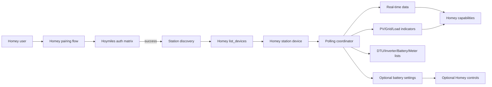
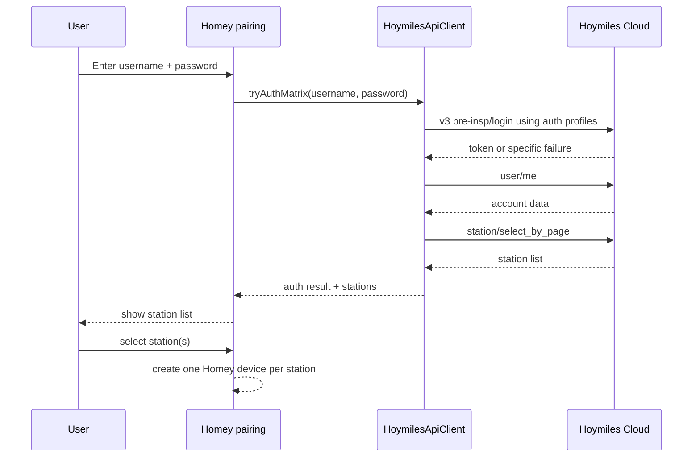
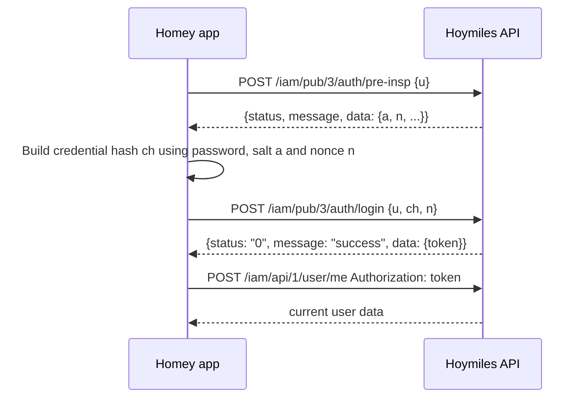
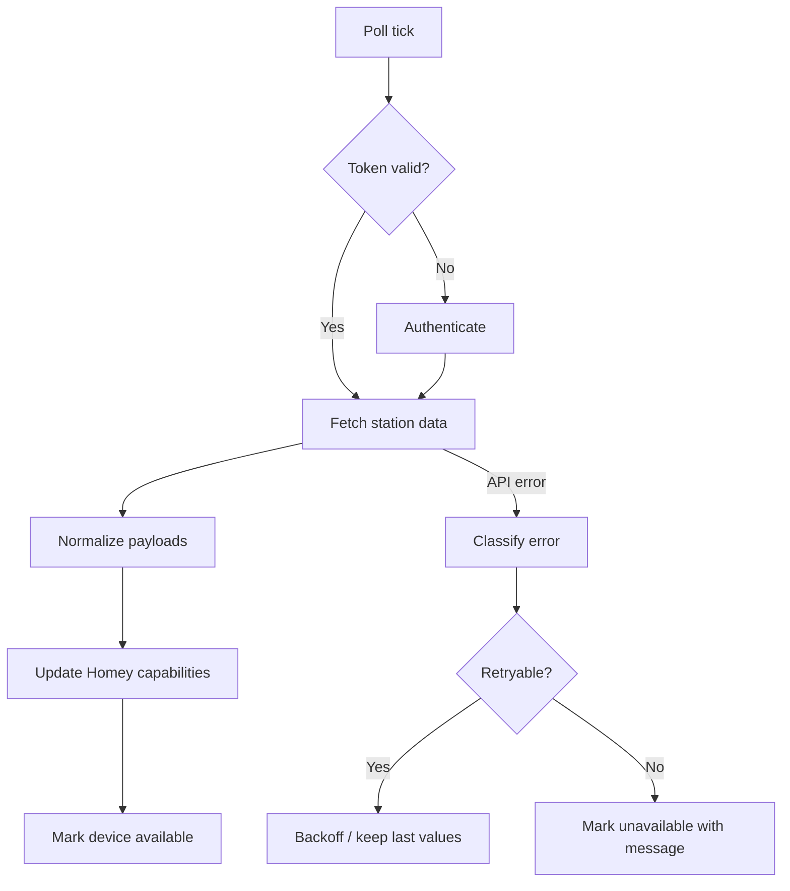
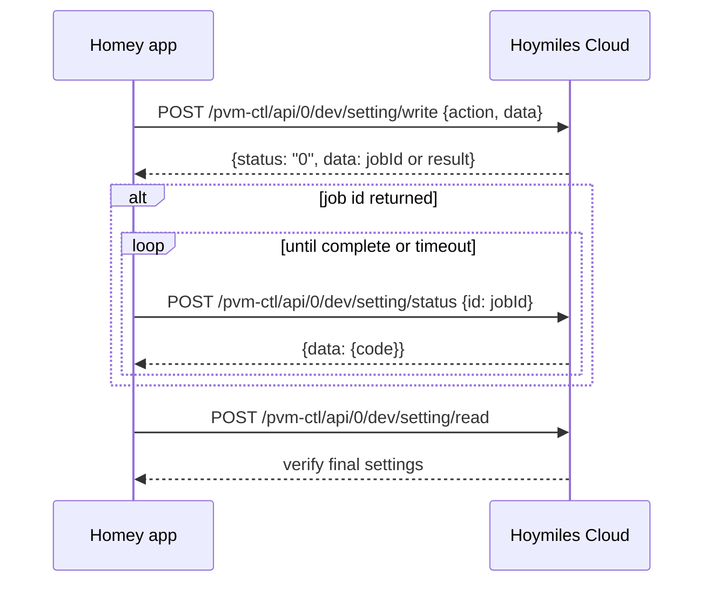

# Hoymiles Cloud API Integration for Homey — Solution Design

Both: Local (LAN) and Cloud are still not working. I want to focus on getting Cloud to work.
Below I captured information which might allow you to fix the codebase so that Cloud will work.
Please analyze this information carefully, then analyze the codebase and change the implementation where needed so that Cloud will work.

**Target system:** Hoymiles HiOne-16T-G3 + HiBox-63T-G3 monitored through Hoymiles / S-Miles Cloud  
**Target platform:** Homey app, preferably Homey Apps SDK v3  
**Reference implementation:** [`Philra94/homeassistant-hoymiles-cloud`](https://github.com/Philra94/homeassistant-hoymiles-cloud)  
**Date:** 2026-06-15

---

## 1. Executive summary

Your Homey app should not validate credentials by sending a plain username/password request to `https://neapi.hoymiles.com`. The current observed Hoymiles Cloud login flow is more complex:

1. Try a **modern v3 authentication flow**.
2. Start with a **pre-inspection** request that returns a nonce and sometimes a salt.
3. Derive a credential hash from the password.
4. Submit username, derived credential hash and nonce to the v3 login endpoint.
5. Store the returned token.
6. Send that token as the raw `Authorization` header value, **without** `Bearer`.
7. If v3 fails, try other client profiles and, optionally, the older legacy v0 flow.

The `Philra94/homeassistant-hoymiles-cloud` integration explicitly auto-tries multiple authentication strategies: browser-compatible v3 login, S-Miles Installer v3 with app-version metadata, S-Miles Home v3 with app-version metadata, and a legacy v0 fallback. It also warns that messages such as `Can only login to the S-Miles Home.` or `Your app version is low. Please update to the latest version.` usually indicate an account/client compatibility issue rather than a truly wrong password.

For a Homey app, the recommended design is:

- Implement a reusable `HoymilesApiClient`.
- During pairing, authenticate using a **matrix of auth modes** rather than one login call.
- After successful login, call `/iam/api/1/user/me` and station discovery to confirm the account is valid.
- Create one Homey device per Hoymiles station.
- Poll station telemetry every 60 seconds by default.
- Expose battery controls only when Hoymiles returns readable/writable battery setting payloads.
- Log sanitized auth attempts so a “wrong credentials” message can be diagnosed correctly.

---

## 2. Source-based reference findings

### 2.1 What the reference integration supports

The `Philra94/homeassistant-hoymiles-cloud` README says the integration monitors and controls Hoymiles inverter systems through the Hoymiles Cloud API. It exposes solar PV generation, battery charge/discharge power, battery state of charge, grid import/export, load consumption, daily/total energy generation, dynamic PV channel discovery and battery diagnostics.

It also states that controls are only exposed when the Hoymiles account returns writable battery settings data. This is important for a Homey app: do not assume every authenticated account can write battery settings.

### 2.2 Authentication behavior

The reference integration says it auto-tries:

- browser-compatible v3 login;
- S-Miles Installer v3 retry with app-version metadata;
- S-Miles Home v3 retry with app-version metadata;
- legacy v0 login fallback.

It also states that more specific Hoymiles rejection messages should be surfaced instead of flattening everything into a generic authentication failure.

The code confirms that the v3 flow starts with:

```text
POST /iam/pub/3/auth/pre-insp
```

and then submits to:

```text
POST /iam/pub/3/auth/login
```

The code comments describe the credential-hash behavior:

- if the pre-inspection response contains salt field `a`, compute an **Argon2id** hash from the password and salt, then send the hex digest as `ch`;
- if `a` is null, try observed no-salt variants:
  - `md5(password) + "." + base64(sha256(password))`;
  - plain `sha256(password)` hex digest;
- send the nonce `n` returned by pre-inspection back in the login request;
- use the returned token directly in the `Authorization` header.

The code also says the API expects the raw token, not a `Bearer` prefix.

### 2.3 Current endpoint set from reference implementation

The reference integration defines these base URLs and endpoint paths:

```text
API_BASE_URL        = https://neapi.hoymiles.com
API_EU_BASE_URL     = https://euapi.hoymiles.com
API_STREAM_BASE_URL = https://eurt.hoymiles.com
```

Important endpoints:

| Purpose | Method | Endpoint |
|---|---:|---|
| v3 pre-inspection | POST | `/iam/pub/3/auth/pre-insp` |
| v3 login | POST | `/iam/pub/3/auth/login` |
| legacy v0 login | POST | `/iam/pub/0/auth/login` |
| current user | POST | `/iam/api/1/user/me` |
| station list | POST | `/pvm/api/0/station/select_by_page` |
| station details | POST | `/pvm/api/0/station/find` |
| station setting rules | POST | `/pvm/api/0/station/setting_rule` |
| station real-time data | POST | `/pvm-data/api/0/station/data/count_station_real_data` |
| energy-flow statistics | POST | `/pvm-data/api/0/station/data_fd/stat_g_a` |
| indicators | POST | `/pvm-data/api/0/indicators/data/select_real_indicators_data` |
| DTUs by station | POST | `/pvm/api/0/dev/dtu/select_by_station` |
| inverters by station | POST | `/pvm/api/0/dev/inverter/select_by_station` |
| batteries by station | POST | `/pvm/api/0/dev/battery/select_by_station` |
| meters by station | POST | `/pvm/api/0/dev/meter/select_by_station` |
| battery settings read | POST | `/pvm-ctl/api/0/dev/setting/read` |
| battery settings write | POST | `/pvm-ctl/api/0/dev/setting/write` |
| battery settings status | POST | `/pvm-ctl/api/0/dev/setting/status` |
| EPS settings | POST | `/eps/api/0/setting/g_a` |
| EPS profit/statistics | POST | `/eps/api/0/record/stat_a` |
| AI status | POST | `/pvm-ai/api/0/station/sar_g_c` |
| firmware status | POST | `/pvm/api/0/upgrade/compare` |

---

## 3. Key design principle: authentication must be profile-based

The error in your current Homey app is probably not the username/password field itself. It is more likely caused by one of these problems:

- using the wrong login endpoint;
- sending the raw password instead of the derived `ch` value;
- hashing the password incorrectly;
- omitting the pre-inspection nonce;
- using the wrong client profile headers;
- using `Bearer <token>` instead of the raw token;
- treating Hoymiles account-family errors as “wrong credentials”;
- using a Home account against an Installer/Web backend, or vice versa;
- not supporting the newer v3 login flow.

Therefore, pairing should not call a single `testCredentials()` method. It should call:

```text
tryAuthMatrix(username, password)
```

and keep the full sanitized result list.

---

## 4. Proposed Homey architecture



### 4.1 Components

| Component | Responsibility |
|---|---|
| `app.js` | Global app startup, optional shared API-client cache. |
| `drivers/hoymiles_station/driver.js` | Pairing, authentication, station discovery, device creation. |
| `drivers/hoymiles_station/device.js` | Polling, capability updates, availability, settings updates. |
| `lib/HoymilesApiClient.js` | All Hoymiles HTTP, auth, token refresh, retries, error normalization. |
| `lib/HoymilesAuth.js` | Auth modes, v3 hashing, legacy v0 fallback, header construction. |
| `lib/HoymilesMapper.js` | Maps Hoymiles payload keys to Homey capabilities. |
| `lib/HoymilesErrors.js` | Normalizes API status/message to actionable error classes. |

---

## 5. Homey pairing design

Use Homey’s **credentials login** pairing template, not OAuth2, because Hoymiles does not provide a standard OAuth2 authorization flow for this use case.



### 5.1 Pairing steps

1. `login_credentials`
   - collect username/password;
   - call `tryAuthMatrix()`;
   - if it fails, show the best Hoymiles failure reason, not just “wrong credentials”.

2. `list_devices`
   - call `getStations()`;
   - show each station as a selectable Homey device.

3. `add_devices`
   - create device(s) with:
     - `data.id = stationId`;
     - `settings.username`;
     - encrypted/hidden password setting if possible;
     - auth mode used;
     - base URL used;
     - poll interval.

### 5.2 Why one Homey device per station?

Hoymiles Cloud is station-centric. Most endpoints require `sid`, for example:

```json
{ "sid": 123456 }
```

Creating one Homey device per station fits the API model and keeps capabilities grouped logically.

---

## 6. Authentication design in detail

### 6.1 Auth modes

Implement these auth modes:

```js
const AUTH_MODE_AUTO = 'auto';
const AUTH_MODE_WEB_V3 = 'web_v3';
const AUTH_MODE_INSTALLER_V3 = 'installer_v3';
const AUTH_MODE_HOME_V3 = 'home_v3';
const AUTH_MODE_LEGACY_V0 = 'legacy_v0';
```

`auto` should try a matrix. Recommended first version:

```text
1. web_v3
2. installer_v3
3. home_v3 only if you know the correct Home backend and headers
4. legacy_v0
```

Important: the latest reference source warns that the S-Miles Home consumer backend may not be fully known/configured. Do not silently send S-Miles Home credentials to the wrong host. If `home_v3` is not correctly configured, fail fast with an explicit message.

### 6.2 Header profiles

Use profile-specific headers. At minimum:

```http
Content-Type: application/json
Accept: application/json
User-Agent: <profile-specific user agent>
```

For app-style profiles, also send app-version metadata when applicable:

```http
App-Version: 3.7.1
X-App-Version: 3.7.1
```

For the S-Miles Home profile, the reference implementation notes that the User-Agent shape is different and must look like a genuine S-Miles app User-Agent, e.g. structurally:

```text
sma/ad/{version}/{tid}/{dc}
```

Do not invent `tid` or `dc`. Read these from your reference constants or from a sanitized browser/mobile network trace.

### 6.3 v3 login sequence



### 6.4 v3 pre-inspection

Request:

```http
POST https://neapi.hoymiles.com/iam/pub/3/auth/pre-insp
Content-Type: application/json
Accept: application/json
```

Body:

```json
{
  "u": "user@example.com"
}
```

Expected successful shape:

```json
{
  "status": "0",
  "message": "success",
  "data": {
    "a": "salt-or-null",
    "n": "nonce"
  }
}
```

The reference code also supports a response where `a`, `n` and/or `u` appear at the top level.

### 6.5 v3 credential hash variants

#### Case A — salted response

If `data.a` is present:

```text
salt = decode(data.a)
ch = hex(Argon2id(password, salt, time_cost=3, memory_cost=32768, parallelism=1, hash_len=32))
```

Submit:

```json
{
  "u": "user@example.com",
  "ch": "argon2id-hex-digest",
  "n": "nonce-from-pre-insp"
}
```

#### Case B — no salt response

If `data.a` is null/empty, try these observed candidates:

Candidate 1:

```text
ch = md5(password) + "." + base64(sha256(password).digest())
```

Candidate 2:

```text
ch = sha256(password).hex()
```

Important: if you retry a second candidate, run pre-inspection again to get a fresh nonce.

### 6.6 v3 login

Request:

```http
POST https://neapi.hoymiles.com/iam/pub/3/auth/login
Content-Type: application/json
Accept: application/json
```

Body:

```json
{
  "u": "user@example.com",
  "ch": "derivedCredentialHash",
  "n": "nonce"
}
```

Successful response:

```json
{
  "status": "0",
  "message": "success",
  "data": {
    "token": "..."
  }
}
```

Persist:

```js
this.token = response.data.token;
this.tokenExpiresAt = Date.now() + 7200 * 1000;
```

The reference client uses a default token validity of 7200 seconds.

### 6.7 Authenticated requests

Use:

```http
Authorization: <raw-token>
```

Do **not** use:

```http
Authorization: Bearer <token>
```

This is a common integration bug.

### 6.8 Legacy v0 fallback

Request:

```http
POST https://neapi.hoymiles.com/iam/pub/0/auth/login
Content-Type: application/json
Accept: application/json
```

Body:

```json
{
  "user_name": "user@example.com",
  "password": "md5(password)"
}
```

Use this only as fallback. Do not start with v0 for new accounts.

---

## 7. Authentication pseudo-code for Homey / Node.js

```js
class HoymilesApiClient {
  constructor({ username, password, baseUrl = 'https://neapi.hoymiles.com', fetchImpl, logger }) {
    this.username = username.trim();
    this.password = password; // do not trim password
    this.baseUrl = baseUrl.replace(/\/$/, '');
    this.fetch = fetchImpl || fetch;
    this.logger = logger || console;
    this.token = null;
    this.tokenExpiresAt = 0;
    this.lastAuthAttempts = [];
    this.activeProfile = null;
  }

  async authenticate({ mode = 'auto' } = {}) {
    const attempts = this.buildAuthAttempts(mode);
    this.lastAuthAttempts = [];

    for (const attempt of attempts) {
      const result = attempt.mode === 'legacy_v0'
        ? await this.authenticateLegacyV0(attempt)
        : await this.authenticateV3(attempt);

      this.lastAuthAttempts.push(this.sanitizeAttempt(result));

      if (result.success) {
        this.token = result.token;
        this.tokenExpiresAt = Date.now() + 7200 * 1000;
        this.activeProfile = result.profile;
        return result;
      }
    }

    throw new HoymilesAuthError(this.chooseBestFailure(this.lastAuthAttempts));
  }

  async authenticatedPost(path, body) {
    if (!this.token || Date.now() >= this.tokenExpiresAt) {
      await this.authenticate();
    }

    return this.post(path, body, {
      ...this.headersForProfile(this.activeProfile),
      Authorization: this.token, // raw token, no Bearer
    });
  }
}
```

### 7.1 Hashing implementation notes

Node.js built-in `crypto` supports MD5/SHA-256 but not Argon2id. For salted v3 accounts you need a compatible Argon2id implementation.

Options:

1. Use a WASM/pure-JS Argon2id package that works inside the Homey app runtime.
2. Use a native package only if Homey app packaging and target hardware support it reliably.
3. Temporarily support only no-salt flows, but then clearly log: `Argon2id required but unavailable`.

Do not show the password, hashes, nonce or token in logs.

---

## 8. Station discovery design

After successful authentication, validate the login by calling:

```http
POST /iam/api/1/user/me
Authorization: <raw-token>
```

Then fetch stations with pagination:

```http
POST /pvm/api/0/station/select_by_page
Authorization: <raw-token>
```

Payload:

```json
{
  "page_size": 100,
  "page_num": 1
}
```

Continue until:

- returned list is empty;
- number of collected stations reaches `data.total`;
- returned page length is smaller than `page_size`.

Map stations to Homey devices:

```js
return stations.map(station => ({
  name: station.name || `Hoymiles Station ${station.id}`,
  data: { id: String(station.id) },
  settings: {
    username,
    password,
    authMode: authResult.mode,
    baseUrl: 'https://neapi.hoymiles.com',
    pollIntervalSeconds: 60,
  },
}));
```

---

## 9. Data retrieval design

### 9.1 Polling strategy

Use a default polling interval of 60 seconds. The Home Assistant reference integration also updates sensors every minute by default.



### 9.2 Minimum endpoints per poll

For a first working Homey app, use this minimal set:

| Frequency | Endpoint | Purpose |
|---|---|---|
| on pairing / once daily | `/pvm/api/0/station/find` | Station metadata. |
| every 60s | `/pvm-data/api/0/station/data/count_station_real_data` | Main real-time station data. |
| every 60s | `/pvm-data/api/0/indicators/data/select_real_indicators_data` type PV/Grid/Load | Detailed indicators. |
| every 5–15 min | `/pvm/api/0/dev/inverter/select_by_station` | Inverter list/status. |
| every 5–15 min | `/pvm/api/0/dev/battery/select_by_station` | Battery list/status. |
| every 5–15 min | `/pvm/api/0/dev/meter/select_by_station` | Meter list/status. |
| every 5–15 min | `/pvm/api/0/dev/dtu/select_by_station` | DTU/data logger list/status. |
| optional | `/pvm-ctl/api/0/dev/setting/read` | Battery settings and supported modes. |

### 9.3 Indicator types

The reference implementation separates indicators by type:

- PV indicators;
- grid indicators;
- load indicators.

Do not hard-code PV1/PV2 only. The reference integration dynamically creates PV input sensors based on indicator keys returned by the API. For HiOne-16T-G3, this matters because the system may expose multiple MPPT/PV channels.

Recommended approach:

```js
const indicatorTypes = {
  pv: INDICATOR_TYPE_PV,
  grid: INDICATOR_TYPE_GRID,
  load: INDICATOR_TYPE_LOAD,
};
```

If you do not know the numeric constants yet, capture actual responses from the reference integration or inspect its `const.py` fully.

---

## 10. Homey capability model

### 10.1 Recommended station capabilities

Use standard Homey capabilities where possible and custom capabilities where needed.

| Hoymiles concept | Homey capability suggestion | Unit | Notes |
|---|---|---:|---|
| Current PV production | `measure_power` or custom `measure_power.pv` | W | If only one power capability is allowed, use custom for detailed values. |
| Battery SOC | `measure_battery` | % | Standard Homey battery percentage. |
| Battery charge power | custom `measure_power.battery_charge` | W | Positive value. |
| Battery discharge power | custom `measure_power.battery_discharge` | W | Positive value. |
| Net battery power | custom `measure_power.battery_net` | W | Positive discharge / negative charge, or document convention. |
| Grid import power | custom `measure_power.grid_import` | W | Positive import. |
| Grid export power | custom `measure_power.grid_export` | W | Positive export. |
| Load consumption | custom `measure_power.load` | W | Household/load. |
| Daily PV energy | custom `meter_power.daily_pv` or `meter_energy.daily_pv` | kWh | Use Homey energy conventions carefully. |
| Total PV energy | custom `meter_power.total_pv` or `meter_energy.total_pv` | kWh | Cumulative. |
| Inverter online state | custom boolean/alarm | boolean | Could be `alarm_generic` if failure. |
| Active battery mode | custom enum/select | text/int | Only if returned. |
| Firmware update available | custom boolean | boolean | Optional. |

### 10.2 Controls

Do not expose battery controls until the account returns writable settings.

Potential controls:

| Control | Requirement |
|---|---|
| Set battery mode | Battery settings readable and writable. |
| Reserve SOC | Current mode supports `reserve_soc`. |
| Peak shaving settings | Mode 7 / peak shaving payload available. |
| Economy schedule | Full Economy payload available. |
| Time-of-Use schedule | Full TOU payload available. |
| Relay/dry contact | Relay settings readable/writable. |

Keep read-only telemetry working even when controls are unavailable.

---

## 11. Battery settings write model

The reference integration is cautious about battery writes:

- controls are exposed only if writable settings data exists;
- schedule writes preserve the full structured Hoymiles payload;
- some battery settings follow an async command model: `read/write -> job id -> status poll`.

### 11.1 Async command sequence



### 11.2 Safety rules for Homey

- Do not write settings during initial pairing.
- Require a separate user action / Flow card for writes.
- Validate ranges locally before submitting.
- Preserve unknown fields in mode payloads.
- After a successful write, re-read and verify.
- If write support is uncertain for HiOne/HiBox, start with read-only app release.

---

## 12. Error handling and diagnostics

### 12.1 Error classification

Create typed error classes:

```js
class HoymilesAuthError extends Error {}
class HoymilesAccountFamilyError extends HoymilesAuthError {}
class HoymilesAppVersionError extends HoymilesAuthError {}
class HoymilesPermissionError extends Error {}
class HoymilesRateLimitError extends Error {}
class HoymilesNetworkError extends Error {}
class HoymilesApiShapeError extends Error {}
```

### 12.2 Common authentication messages

| Hoymiles message | Meaning | User-facing message |
|---|---|---|
| `Can only login to the S-Miles Home.` | Account/client family mismatch. | “The account appears to require the S-Miles Home login profile, not the current profile.” |
| `Your app version is low. Please update to the latest version.` | App-version/header mismatch. | “Hoymiles rejected the app profile/version. Try another auth mode or update app-version metadata.” |
| `invalid credentials` / `check your account and password` | Could be wrong password or wrong hash variant. | “Credentials were rejected. Verify password and auth mode.” |
| missing nonce from pre-inspection | API shape changed or wrong backend. | “Hoymiles pre-login response was incomplete. Capture sanitized pre-insp response.” |
| `Argon2 support is unavailable` | App cannot compute salted v3 hash. | “This account requires Argon2id login; the app build lacks Argon2 support.” |

### 12.3 Logging requirements

Log this:

```json
{
  "authAttempts": [
    { "mode": "web_v3", "profile": "web", "success": false, "status": "1", "message": "..." },
    { "mode": "installer_v3", "profile": "installer", "success": true }
  ]
}
```

Never log this:

- password;
- raw token;
- full `Authorization` header;
- full derived hash `ch`;
- nonce `n`;
- salt `a` if you want to be extra cautious.

### 12.4 What to show in Homey pairing

Bad:

```text
Credentials are wrong.
```

Good:

```text
Hoymiles rejected all login profiles. Best failure: S-Miles Home account/profile mismatch. This usually means the password may be correct, but the app used the wrong Hoymiles client profile or app-version headers.
```

---

## 13. Concrete checklist to fix your current Homey app

### 13.1 Authentication checklist

- [ ] Use `https://neapi.hoymiles.com` as default base URL.
- [ ] Use HTTPS port 443 implicitly.
- [ ] Implement `/iam/pub/3/auth/pre-insp` before login.
- [ ] Send `{ "u": username }` to pre-insp.
- [ ] Parse `status`, `message`, `data.a`, `data.n`.
- [ ] If `a` exists, compute Argon2id with parameters:
  - `time_cost = 3`
  - `memory_cost = 32768`
  - `parallelism = 1`
  - `hash_len = 32`
  - output hex digest
- [ ] If `a` is missing/null, try:
  - `md5(password) + "." + base64(sha256(password).digest())`
  - `sha256(password).hex()`
- [ ] Re-run pre-insp before retrying a second unsalted candidate.
- [ ] Send `{ "u": username, "ch": credentialHash, "n": nonce }` to `/iam/pub/3/auth/login`.
- [ ] Store `data.token`.
- [ ] Use `Authorization: token`, not `Authorization: Bearer token`.
- [ ] Implement multiple auth profiles, including app-version headers.
- [ ] Implement legacy v0 fallback only after v3 attempts.
- [ ] Surface actual Hoymiles status/message.

### 13.2 Pairing checklist

- [ ] Use Homey `login_credentials` pairing template.
- [ ] Do not call `list_devices` until auth succeeded.
- [ ] After auth, call `user/me`.
- [ ] Call station list endpoint with pagination.
- [ ] Create one Homey device per station.
- [ ] Store station ID in `data.id`.
- [ ] Store auth mode/base URL/poll interval in settings.
- [ ] Avoid storing raw password in logs.

### 13.3 Polling checklist

- [ ] Refresh token when older than ~7200 seconds or when API rejects it.
- [ ] Poll real-time data every 60 seconds.
- [ ] Poll slow metadata every 5–15 minutes.
- [ ] Keep last known values if a temporary API failure occurs.
- [ ] Mark unavailable only after repeated failures.
- [ ] Support accounts with partial telemetry but no battery setting permissions.

---

## 14. Suggested file structure for your Homey app

```text
com.hoymiles.cloud/
├─ .homeycompose/
│  └─ app.json
├─ drivers/
│  └─ station/
│     ├─ driver.compose.json
│     ├─ driver.js
│     ├─ device.js
│     └─ assets/
├─ lib/
│  ├─ HoymilesApiClient.js
│  ├─ HoymilesAuth.js
│  ├─ HoymilesMapper.js
│  ├─ HoymilesErrors.js
│  └─ crypto/
│     └─ argon2.js
├─ app.js
├─ package.json
└─ README.md
```

---

## 15. Example Homey pairing skeleton

```js
// drivers/station/driver.js
'use strict';

const Homey = require('homey');
const { HoymilesApiClient } = require('../../lib/HoymilesApiClient');

class HoymilesStationDriver extends Homey.Driver {
  async onPair(session) {
    let credentials = null;
    let api = null;
    let stations = [];

    session.setHandler('login', async (data) => {
      credentials = {
        username: String(data.username || '').trim(),
        password: String(data.password || ''),
      };

      api = new HoymilesApiClient({
        username: credentials.username,
        password: credentials.password,
        logger: this.log.bind(this),
      });

      try {
        const authResult = await api.authenticate({ mode: 'auto' });
        const user = await api.getCurrentUser();
        stations = await api.getStations();

        if (!stations.length) {
          throw new Error('Login succeeded, but no Hoymiles stations were returned for this account.');
        }

        credentials.authMode = authResult.mode;
        credentials.baseUrl = api.baseUrl;
        return true;
      } catch (err) {
        this.error('Hoymiles pairing authentication failed', api?.getSanitizedAuthSummary?.(), err.message);
        throw new Error(api?.getUserFriendlyAuthError?.(err) || err.message);
      }
    });

    session.setHandler('list_devices', async () => {
      return stations.map((station) => ({
        name: station.name || `Hoymiles Station ${station.id}`,
        data: { id: String(station.id) },
        settings: {
          username: credentials.username,
          password: credentials.password,
          authMode: credentials.authMode,
          baseUrl: credentials.baseUrl,
          pollIntervalSeconds: 60,
        },
      }));
    });
  }
}

module.exports = HoymilesStationDriver;
```

---

## 16. Example API-client skeleton

```js
// lib/HoymilesApiClient.js
'use strict';

const crypto = require('crypto');

class HoymilesApiClient {
  constructor({ username, password, baseUrl = 'https://neapi.hoymiles.com', logger = console }) {
    this.username = username.trim();
    this.password = password;
    this.baseUrl = baseUrl.replace(/\/$/, '');
    this.logger = logger;
    this.token = null;
    this.tokenExpiresAt = 0;
    this.activeProfile = null;
    this.lastAuthAttempts = [];
  }

  md5Hex(value) {
    return crypto.createHash('md5').update(value, 'utf8').digest('hex');
  }

  sha256Hex(value) {
    return crypto.createHash('sha256').update(value, 'utf8').digest('hex');
  }

  sha256Base64(value) {
    return crypto.createHash('sha256').update(value, 'utf8').digest('base64');
  }

  async post(path, body, headers = {}) {
    const res = await fetch(`${this.baseUrl}${path}`, {
      method: 'POST',
      headers: {
        'Content-Type': 'application/json',
        Accept: 'application/json',
        ...headers,
      },
      body: JSON.stringify(body),
    });

    const text = await res.text();
    let json;
    try {
      json = JSON.parse(text);
    } catch (err) {
      throw new Error(`Hoymiles returned non-JSON response from ${path}: HTTP ${res.status}`);
    }
    return json;
  }

  async getCurrentUser() {
    return this.authenticatedPost('/iam/api/1/user/me', {});
  }

  async getStations() {
    const stations = [];
    let pageNum = 1;
    const pageSize = 100;
    let total = null;

    while (true) {
      const resp = await this.authenticatedPost('/pvm/api/0/station/select_by_page', {
        page_size: pageSize,
        page_num: pageNum,
      });

      if (resp.status !== '0' || resp.message !== 'success') {
        throw new Error(`Failed to get stations: ${resp.status} - ${resp.message}`);
      }

      const data = resp.data || {};
      const list = Array.isArray(data.list) ? data.list : [];
      total = total ?? data.total;
      stations.push(...list);

      if (!list.length) break;
      if (total != null && stations.length >= Number(total)) break;
      if (list.length < pageSize) break;
      pageNum += 1;
    }

    return stations;
  }

  async authenticatedPost(path, body) {
    if (!this.token || Date.now() >= this.tokenExpiresAt) {
      await this.authenticate({ mode: 'auto' });
    }

    return this.post(path, body, {
      ...this.headersForProfile(this.activeProfile),
      Authorization: this.token,
    });
  }
}

module.exports = { HoymilesApiClient };
```

This skeleton intentionally omits full auth implementation details so you can place them in `HoymilesAuth.js` and unit-test them separately.

---

## 17. Validation plan

### 17.1 Test outside Homey first

Before debugging Homey pairing UI, create a standalone Node script:

```bash
node scripts/test-hoymiles-login.js --username "you@example.com" --mode auto
```

It should:

1. run the auth matrix;
2. print sanitized attempts;
3. call `user/me`;
4. call station list;
5. print station IDs/names.

### 17.2 Test matrix

| Test | Expected result |
|---|---|
| Correct account + correct profile | Login succeeds; token returned. |
| Correct password + wrong profile | Specific Hoymiles profile/app-version message. |
| Wrong password | Credential rejection across profiles. |
| Missing Argon2 support + salted account | Explicit `Argon2id required` error. |
| Token without `Bearer` | Authenticated endpoints work. |
| Token with `Bearer` | Authenticated endpoints likely fail. |
| Multi-station account | All stations returned through pagination. |
| Account without writable battery settings | Telemetry works; controls hidden. |

### 17.3 Useful sanitized debug output

```json
{
  "baseUrl": "https://neapi.hoymiles.com",
  "authAttempts": [
    {
      "mode": "web_v3",
      "profile": "web",
      "variant": "argon2_v3",
      "success": false,
      "status": "1",
      "message": "Can only login to the S-Miles Home."
    },
    {
      "mode": "installer_v3",
      "profile": "installer",
      "variant": "argon2_v3",
      "success": true
    }
  ]
}
```

---

## 18. Recommended first release scope for your Homey app

### Include in first working release

- Pairing with username/password.
- Auth matrix with at least `web_v3`, `installer_v3`, legacy v0.
- Explicit auth diagnostics.
- Station discovery.
- Read-only telemetry.
- Battery SOC.
- PV/grid/load/battery power if returned.
- Energy totals if returned.
- Device availability and retry/backoff.

### Exclude from first release

- Battery write controls.
- Time-of-use schedule editor.
- Peak shaving controls.
- Relay/dry-contact controls.
- Firmware update actions.

Reason: write endpoints are more risky and account/hardware dependent. Get reliable read-only operation first.

---

## 19. Most likely root cause of your current “credentials are wrong” issue

Given the reference implementation, the most likely causes are:

1. Your app is using a **single auth flow** instead of trying multiple profiles.
2. Your app is not doing `/iam/pub/3/auth/pre-insp` first.
3. Your app is sending **plain password** or simple MD5 to the v3 login endpoint.
4. Your app lacks **Argon2id** support for salted v3 authentication.
5. Your app uses the wrong **User-Agent/App-Version** headers for your account type.
6. Your app uses `Authorization: Bearer <token>` instead of the raw token.
7. Your UI converts all Hoymiles errors into “credentials wrong”.

Fix those before changing the user-facing pairing flow.

---

## 20. References

- Philra94 Home Assistant Hoymiles Cloud integration: https://github.com/Philra94/homeassistant-hoymiles-cloud
- Reference README: https://github.com/Philra94/homeassistant-hoymiles-cloud#readme
- Reference API client: https://github.com/Philra94/homeassistant-hoymiles-cloud/blob/main/custom_components/hoymiles_cloud/hoymiles_api.py
- Reference constants: https://github.com/Philra94/homeassistant-hoymiles-cloud/blob/main/custom_components/hoymiles_cloud/const.py
- Reference issue #27, auth message `Can only login to the S-Miles Home`: https://github.com/Philra94/homeassistant-hoymiles-cloud/issues/27
- Reference issue #30, invalid auth around S-Miles Home support: https://github.com/Philra94/homeassistant-hoymiles-cloud/issues/30
- Homey Apps SDK: https://apps.developer.homey.app/
- Homey credentials login pairing: https://apps.developer.homey.app/the-basics/devices/pairing/system-views/credentials-login
- Homey pairing documentation: https://apps.developer.homey.app/the-basics/devices/pairing

---

## 21. Final recommendation

Implement authentication first as a standalone, testable module. Do not debug inside the Homey pairing UI until the standalone script can:

1. login;
2. call `user/me`;
3. list stations;
4. fetch real-time data for one station.

Once that works, wire the same client into the Homey driver pairing flow.
