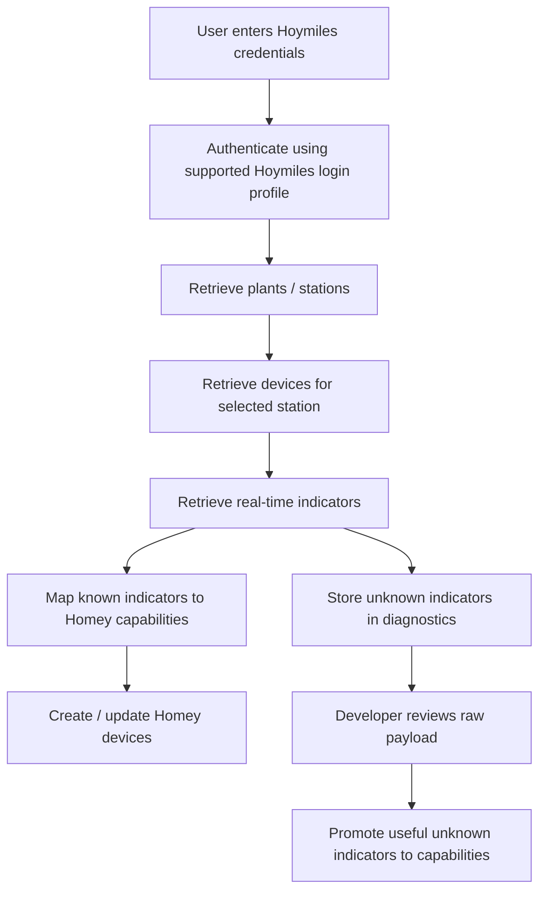
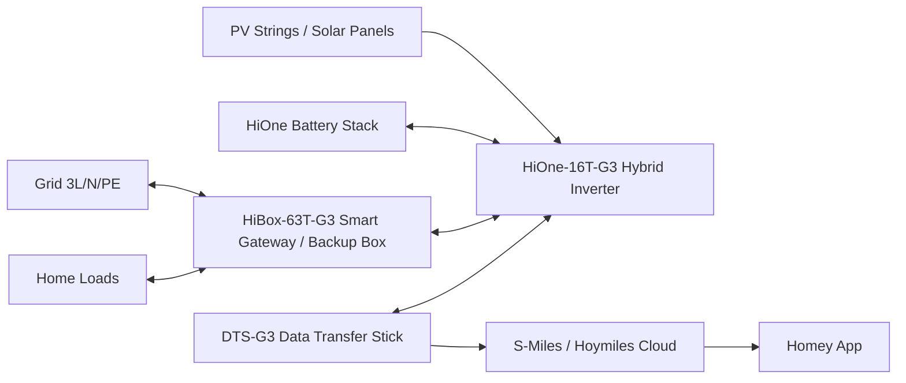
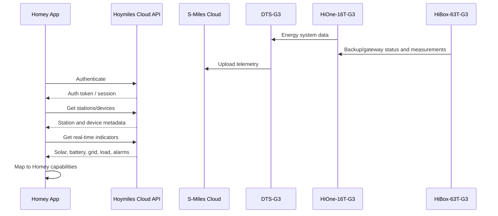
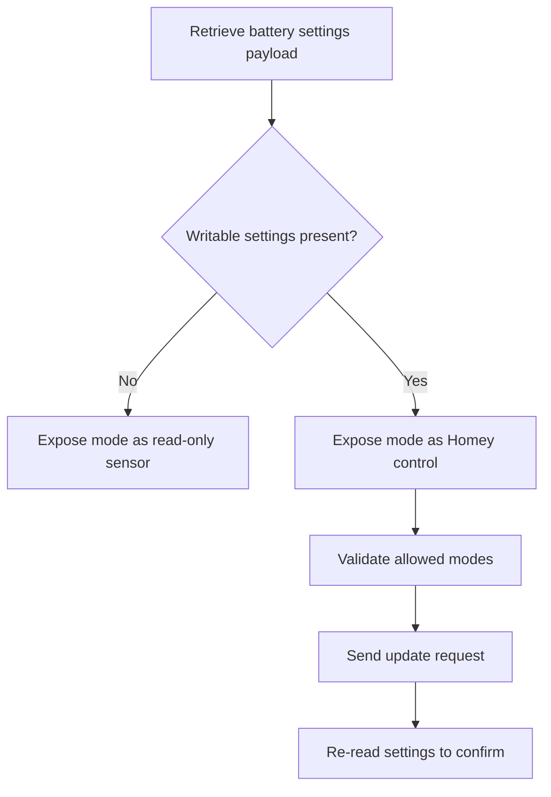
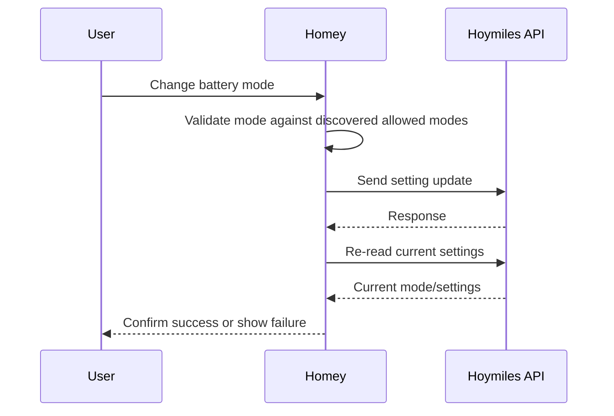
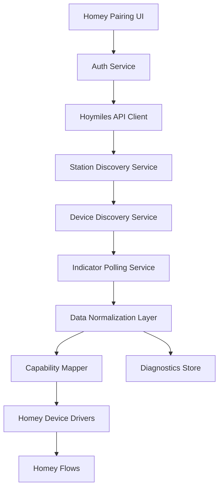
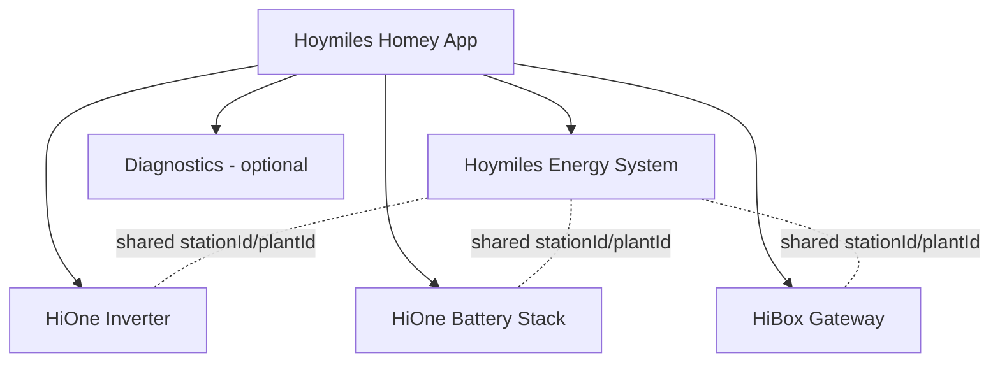
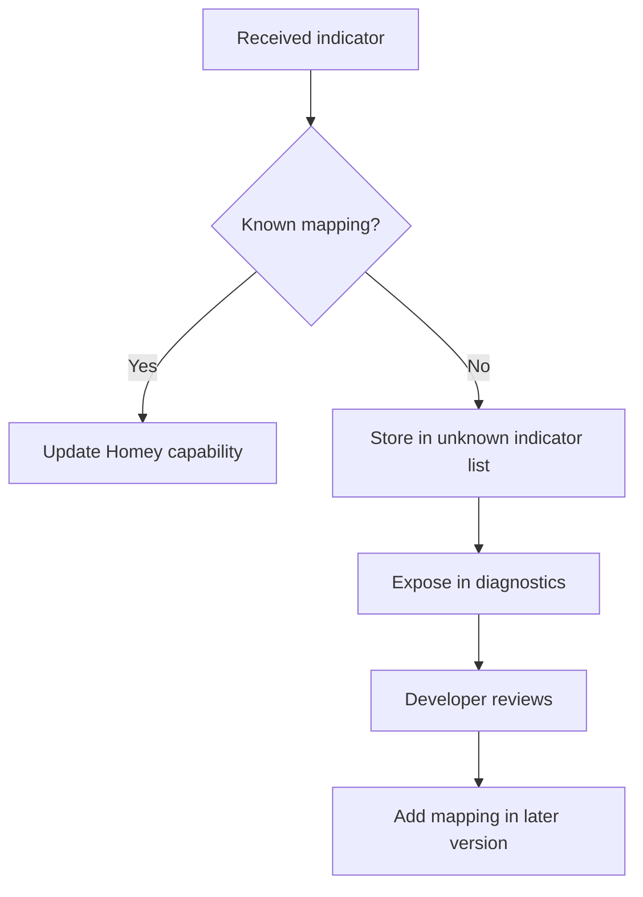
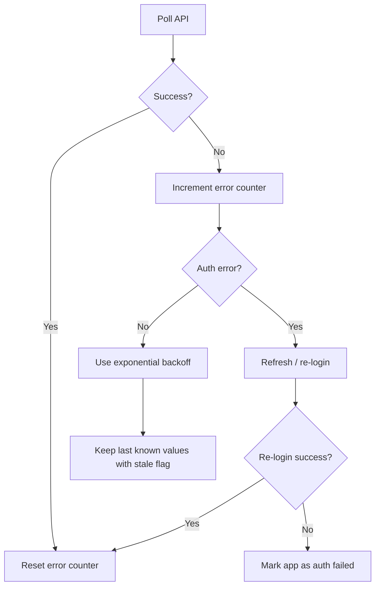
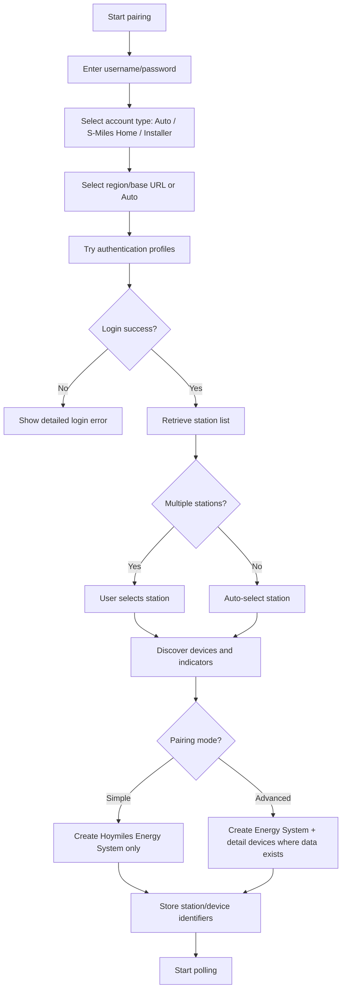

# Solution Design: Hoymiles HiOne-16T-G3 + HiBox-63T-G3 Data Integration for a Homey App

After your latest changes after giving username and password I am getting the error: 'Hoymiles: Pre-inspection request failed: Network error: fetch is not defined'. Also it shows the error message: 'pairsession_not_found'.
Please analyze and fix the issue.
Furthermore analyze this change request document in full detail and change the codebase accordingly.
If images are needed, please take them from what we already have e.g. the current device.
Also update README.md, README.txt and README.nl.txt files accordingly.

**Author:** ChatGPT  
**Prepared for:** Robert Coemans  
**Date:** 2026-06-15  
**Target platform:** Homey / Homey Pro app  
**Target devices:** Hoymiles HiOne-16T-G3, HiBox-63T-G3, DTS-G3 / S-Miles Cloud ecosystem  
**Preferred integration path:** Hoymiles Cloud API, inspired by `Philra94/homeassistant-hoymiles-cloud`

---

## 1. Executive Summary

This document describes a solution design for retrieving and exposing data from a **Hoymiles HiOne-16T-G3** system with **HiBox-63T-G3** in a **Homey app**.

The recommended first implementation is **cloud-based**, using the Hoymiles / S-Miles Cloud API pattern demonstrated by the open-source Home Assistant integration `Philra94/homeassistant-hoymiles-cloud`. That project focuses on Hoymiles battery-storage systems and exposes values such as solar generation, battery charge/discharge, state of charge, grid import/export, load consumption, inverter count, and battery setting diagnostics.

The app should be designed with **dynamic data discovery**. Hoymiles API payloads differ by region, device family, account type, and permission level. Therefore the Homey app should not hard-code a fixed HiOne-only register list. Instead, it should:

1. Authenticate against Hoymiles Cloud.
2. Retrieve plants/stations and devices.
3. Retrieve real-time, daily and total energy indicators.
4. Map known values to Homey capabilities.
5. Store unknown indicators in diagnostics.
6. Allow later promotion of useful unknown fields to proper Homey capabilities.

From a Homey UX perspective, the recommended app model is **one main overview device plus optional additional detail devices**. These devices should be created by the same Homey app but treated as independent Homey devices, not as a native parent/child hierarchy.

The most valuable Homey data categories are:

- Solar / PV production.
- PV string or MPPT-level data.
- Battery state of charge.
- Battery charge/discharge power.
- Grid import/export power.
- Home/load consumption.
- Backup/HiBox state.
- Device online status.
- Alarms and fault states.
- Battery operation mode and selected writable settings, if supported by the Hoymiles account.

Temperature values such as inverter temperature, battery temperature, BMS temperature and HiBox temperature should be supported by the app model, but should be treated as **payload-dependent** until confirmed from the live API response for the user’s account.

---

## 2. Reference Sources

This design is based on the following public references:

| Source | Relevance |
|---|---|
| `Philra94/homeassistant-hoymiles-cloud` GitHub repository | Reference cloud integration for Hoymiles battery systems. It documents support for PV generation, battery charge/discharge, SOC, grid import/export, load consumption, battery modes and authentication fallback strategies. |
| Hoymiles HiOne product page | Confirms HiOne-16T-G3 is a three-phase system with 4 MPPT / 4 input strings, 32 kW recommended max PV power, 17.6 kVA max on-grid apparent output and 3L/N/PE grid form. |
| Hoymiles HiBox-63T-G3 product page | Describes HiBox-63T-G3 as a smart gateway / home backup solution communicating with Hoymiles energy-storage inverters. |
| Hoymiles DTS-G3 product page | Describes DTS-G3 as a data transfer stick for energy-storage systems with Bluetooth local commissioning via S-Miles App and Wi-Fi/LAN cloud upload. |
| Home Assistant community topic for Hoymiles Cloud integration | Confirms the integration focus on HYT inverters and battery systems and references battery controls such as operating modes and storage settings. |

Source URLs:

- https://github.com/Philra94/homeassistant-hoymiles-cloud
- https://www.hoymiles.com/products/hione-8-20-t-g3.html
- https://www.hoymiles.com/products/hibox-63t-g3.html
- https://www.hoymiles.com/products/dts-g3.html
- https://community.home-assistant.io/t/integration-hoymiles-cloud-control-hyt-inverters-and-battery-systems/880739

---

## 3. Scope

### 3.1 In Scope

This solution design covers:

- Cloud-based data retrieval from Hoymiles/S-Miles Cloud.
- Homey app device model.
- Homey capability mapping.
- Expected data points for HiOne-16T-G3 and HiBox-63T-G3.
- Authentication and account-type considerations.
- Polling strategy.
- Data normalization.
- Diagnostics and unknown-indicator handling.
- Suggested Homey flows.
- Phased implementation roadmap.

### 3.2 Out of Scope

This document does not provide:

- Official Hoymiles API documentation.
- Reverse-engineered endpoint-by-endpoint code copied from another project.
- A guarantee that every listed datapoint exists for every account.
- Local Modbus RTU/TCP register mapping.
- Warranty-safe control guidance for battery mode changes.

---

## 4. Important Design Principle: Capability Discovery First

Hoymiles Cloud API data should be treated as **dynamic and account-dependent**.

A Homey app should not assume that all HiOne and HiBox fields are available. Instead, the app should implement a discovery process:



This is especially important for HiOne + HiBox because many existing Hoymiles integrations started with microinverters or HYT battery systems. HiOne may expose similar but not identical indicator names.

---

## 5. Target System Context

### 5.1 Physical System

The expected installation consists of:



### 5.2 Logical Data Path

The preferred MVP data path is:



---

## 6. Data Categories for Homey

The following sections describe all potentially useful data categories from the perspective of a Homey app.

Each datapoint is classified as:

- **High confidence:** expected from cloud integrations / known battery-system monitoring.
- **Medium confidence:** likely useful and plausible, but needs payload validation.
- **Low confidence:** interesting but not guaranteed; expose only if discovered.

---

## 7. System-Level Device: “Hoymiles Energy System”

This should be the main Homey device shown to normal users.

### 7.1 Purpose

Provide a simple energy dashboard:

- Solar production.
- Home consumption.
- Battery SOC.
- Battery charging/discharging.
- Grid import/export.
- Backup status.
- System health.

### 7.2 Recommended Capabilities

| Data point | Homey capability suggestion | Unit | Confidence | Notes |
|---|---|---:|---:|---|
| Solar production power total | `measure_power.solar` | W | High | Total current PV generation. |
| Home/load consumption | `measure_power.load` | W | High | Current house consumption. |
| Grid net power | `measure_power.grid` | W | High | Use signed value if possible. Positive = import, negative = export. |
| Grid import power | `measure_power.grid_import` | W | High | Split value for easier Homey flows. |
| Grid export power | `measure_power.grid_export` | W | High | Split value for easier Homey flows. |
| Battery SOC | `measure_battery` or custom percentage | % | High | Main battery state. |
| Battery signed power | `measure_power.battery` | W | High | Positive = charging, negative = discharging, or vice versa; document convention. |
| Battery charge power | `measure_power.battery_charge` | W | High | Split positive value. |
| Battery discharge power | `measure_power.battery_discharge` | W | High | Split positive value. |
| Battery mode | custom enum | text | High | Self-consumption, backup, economy, time-of-use, etc. |
| System online | custom boolean / `alarm_generic` inverse | boolean | High | Indicates cloud/API/device availability. |
| System alarm active | `alarm_generic` | boolean | Medium | Based on fault/alarm payload. |
| Grid outage | `alarm_power_failure` | boolean | Medium | Very useful if exposed. |
| Backup active | custom boolean | boolean | Medium | HiBox-related. |
| Last update timestamp | custom text/datetime | datetime | High | Useful diagnostics. |

### 7.3 Energy Meters

| Data point | Homey capability suggestion | Unit | Confidence |
|---|---|---:|---:|
| Solar energy today | custom meter / `meter_power.solar_today` | kWh | High |
| Solar energy total | custom meter / `meter_power.solar_total` | kWh | High |
| Home consumption today | custom meter | kWh | Medium |
| Grid import today | custom meter | kWh | Medium |
| Grid export today | custom meter | kWh | Medium |
| Battery charged today | custom meter | kWh | Medium |
| Battery discharged today | custom meter | kWh | Medium |

---

## 8. HiOne Inverter Device

Create a separate technical Homey device for inverter details.

### 8.1 Purpose

Expose inverter-specific and PV input details without overloading the main dashboard device.

### 8.2 HiOne-16T-G3 Context

The Hoymiles HiOne-16T-G3 product specification lists:

- Three-phase grid form: `3L/N/PE`.
- Recommended max PV power: `32000 W`.
- MPPT number / input strings: `4 / 4`.
- Max input current: `20/20/20/20 A`.
- Max on-grid output apparent power: `17600 VA`.
- Max off-grid output apparent power: `24000 VA for 10s`.

These specifications justify supporting **four PV channels** in the Homey app.

### 8.3 PV / MPPT Data

| Data point | Homey capability suggestion | Unit | Confidence | Notes |
|---|---|---:|---:|---|
| PV total power | `measure_power.pv_total` | W | High | May duplicate system solar power. |
| PV1 / MPPT1 power | `measure_power.pv1` | W | Medium/High | HiOne-16T has 4 MPPTs; expose if payload exists. |
| PV2 / MPPT2 power | `measure_power.pv2` | W | Medium/High | Dynamic discovery preferred. |
| PV3 / MPPT3 power | `measure_power.pv3` | W | Medium/High | Dynamic discovery preferred. |
| PV4 / MPPT4 power | `measure_power.pv4` | W | Medium/High | Dynamic discovery preferred. |
| PV1 voltage | `measure_voltage.pv1` | V | Medium | Useful for diagnostics. |
| PV2 voltage | `measure_voltage.pv2` | V | Medium | Useful for diagnostics. |
| PV3 voltage | `measure_voltage.pv3` | V | Medium | Useful for diagnostics. |
| PV4 voltage | `measure_voltage.pv4` | V | Medium | Useful for diagnostics. |
| PV1 current | `measure_current.pv1` | A | Medium | Useful for diagnostics. |
| PV2 current | `measure_current.pv2` | A | Medium | Useful for diagnostics. |
| PV3 current | `measure_current.pv3` | A | Medium | Useful for diagnostics. |
| PV4 current | `measure_current.pv4` | A | Medium | Useful for diagnostics. |

### 8.4 AC Output / Inverter Data

| Data point | Homey capability suggestion | Unit | Confidence |
|---|---|---:|---:|
| AC output power total | `measure_power.ac_output` | W | Medium |
| AC output power L1 | `measure_power.ac_l1` | W | Medium |
| AC output power L2 | `measure_power.ac_l2` | W | Medium |
| AC output power L3 | `measure_power.ac_l3` | W | Medium |
| AC voltage L1 | `measure_voltage.ac_l1` | V | Medium |
| AC voltage L2 | `measure_voltage.ac_l2` | V | Medium |
| AC voltage L3 | `measure_voltage.ac_l3` | V | Medium |
| AC current L1 | `measure_current.ac_l1` | A | Medium |
| AC current L2 | `measure_current.ac_l2` | A | Medium |
| AC current L3 | `measure_current.ac_l3` | A | Medium |
| Grid frequency | custom `measure_frequency` | Hz | Medium |
| Inverter temperature | `measure_temperature.inverter` | °C | Medium/Low |
| Inverter status | custom enum | text | Medium |
| Inverter fault code | custom text | text | Medium |

---

## 9. Battery Stack Device

Create a dedicated Homey device for the HiOne battery stack.

### 9.1 Purpose

Expose battery state, charge/discharge, energy counters, temperatures, health and operating mode.

### 9.2 Recommended Battery Capabilities

| Data point | Homey capability suggestion | Unit | Confidence | Notes |
|---|---|---:|---:|---|
| Battery SOC | `measure_battery` | % | High | Most important battery value. |
| Battery signed power | `measure_power.battery` | W | High | Useful for dashboard. |
| Battery charge power | `measure_power.battery_charge` | W | High | Useful for flows. |
| Battery discharge power | `measure_power.battery_discharge` | W | High | Useful for flows. |
| Battery flow direction | custom enum | text | High | `charging`, `discharging`, `idle`. |
| Battery mode | custom enum | text | High | From cloud mode if available. |
| Reserve SOC | custom number setting | % | Medium/High | Only if writable settings exposed. |
| Max SOC | custom number setting | % | Medium | Only if exposed. |
| Battery charge energy today | custom meter | kWh | Medium |
| Battery discharge energy today | custom meter | kWh | Medium |
| Battery total charged energy | custom meter | kWh | Medium |
| Battery total discharged energy | custom meter | kWh | Medium |
| Battery temperature | `measure_temperature.battery` | °C | Medium/Low |
| BMS temperature | `measure_temperature.bms` | °C | Low/Medium |
| Battery SOH | custom percentage | % | Low/Medium |
| Battery alarm | `alarm_battery` | boolean | Medium |
| Battery communication status | custom enum | text | Medium |

### 9.3 Battery Mode Support

The reference Home Assistant integration supports battery operating modes for Hoymiles battery systems when the API and account permissions expose them. Relevant modes include:

- Self-Consumption.
- Economy.
- Backup.
- Off-Grid.
- Peak Shaving.
- Time of Use.

For Homey, implement battery mode in two steps:

1. **Read-only mode display** in the MVP.
2. **Writable mode control** only after successful discovery of writable settings from the API.



---

## 10. Grid and Three-Phase Data

Because the HiOne-16T-G3 and HiBox-63T-G3 are three-phase devices, phase-level grid data is useful if exposed.

### 10.1 Recommended Grid Capabilities

| Data point | Homey capability suggestion | Unit | Confidence | Notes |
|---|---|---:|---:|---|
| Grid net power | `measure_power.grid` | W | High | Signed value preferred. |
| Grid import power | `measure_power.grid_import` | W | High | Positive split value. |
| Grid export power | `measure_power.grid_export` | W | High | Positive split value. |
| Grid L1 power | `measure_power.grid_l1` | W | Medium | Useful for phase balancing. |
| Grid L2 power | `measure_power.grid_l2` | W | Medium | Useful for phase balancing. |
| Grid L3 power | `measure_power.grid_l3` | W | Medium | Useful for phase balancing. |
| Grid L1 voltage | `measure_voltage.grid_l1` | V | Medium | Diagnostic. |
| Grid L2 voltage | `measure_voltage.grid_l2` | V | Medium | Diagnostic. |
| Grid L3 voltage | `measure_voltage.grid_l3` | V | Medium | Diagnostic. |
| Grid L1 current | `measure_current.grid_l1` | A | Medium | Diagnostic. |
| Grid L2 current | `measure_current.grid_l2` | A | Medium | Diagnostic. |
| Grid L3 current | `measure_current.grid_l3` | A | Medium | Diagnostic. |
| Grid frequency | custom frequency | Hz | Medium | Diagnostic. |
| Grid import energy today | custom meter | kWh | Medium |
| Grid export energy today | custom meter | kWh | Medium |
| Grid outage | `alarm_power_failure` | boolean | Medium | Very valuable if available. |

### 10.2 Signed Power Convention

Use one consistent signed convention in the app:

| Value | Meaning |
|---:|---|
| `grid_power > 0` | Importing from grid. |
| `grid_power < 0` | Exporting to grid. |
| `battery_power > 0` | Battery charging. |
| `battery_power < 0` | Battery discharging. |

Also expose split positive values for flows:

```text
battery_charge_power = max(battery_power, 0)
battery_discharge_power = max(-battery_power, 0)
grid_import_power = max(grid_power, 0)
grid_export_power = max(-grid_power, 0)
```

---

## 11. Home / Load Consumption Data

Home consumption is one of the most valuable categories for Homey automations.

| Data point | Homey capability suggestion | Unit | Confidence |
|---|---|---:|---:|
| Home consumption total | `measure_power.load` | W | High |
| Home consumption L1 | `measure_power.load_l1` | W | Medium |
| Home consumption L2 | `measure_power.load_l2` | W | Medium |
| Home consumption L3 | `measure_power.load_l3` | W | Medium |
| Home consumption today | custom meter | kWh | Medium |
| Home consumption total energy | custom meter | kWh | Medium |
| Backup load power | `measure_power.backup_load` | W | Medium |
| Smart load power | custom power | W | Low/Medium |

Suggested Homey flows:

- If home consumption exceeds 10 kW, send notification.
- If grid import exceeds 3 kW while battery SOC > 50%, review battery mode.
- If solar export exceeds 1 kW and battery SOC is below 90%, notify or adjust charging if control is supported.

---

## 12. HiBox-63T-G3 Device

Create a dedicated HiBox device if the API exposes separate HiBox data.

### 12.1 HiBox Functional Context

Hoymiles describes HiBox-63T-G3 as a smart gateway device for home backup. It communicates with Hoymiles energy-storage inverters and provides a comprehensive PV ESS solution.

Expected physical roles:

- Grid connection management.
- Backup/home load management.
- Communication with energy-storage inverter.
- Whole-home backup.
- Smart port functions such as generator / PV inverter / smart load, depending on installation.
- Rapid shutdown support.

### 12.2 Recommended HiBox Capabilities

| Data point | Homey capability suggestion | Unit | Confidence | Notes |
|---|---|---:|---:|---|
| HiBox online | custom boolean | boolean | Medium | If separate device status exists. |
| Grid available | `alarm_power_failure` inverse | boolean | Medium | Critical backup datapoint. |
| Backup active | custom boolean | boolean | Medium | Indicates backup mode. |
| Backup load power | `measure_power.backup_load` | W | Medium | Useful during outage. |
| Backup load energy today | custom meter | kWh | Low/Medium | If available. |
| Generator input status | custom boolean | boolean | Low/Medium | If smart port configured. |
| Smart load status | custom boolean | boolean | Low/Medium | If smart port configured. |
| Smart load power | custom power | W | Low/Medium | If measured. |
| Third-party PV input status | custom boolean | boolean | Low/Medium | If configured. |
| Rapid shutdown status | `alarm_generic` or custom boolean | boolean | Low/Medium | If exposed. |
| HiBox temperature | `measure_temperature.hibox` | °C | Low | Support if payload contains it. |
| HiBox alarm code | custom text | text | Medium | Useful for troubleshooting. |

### 12.3 HiBox Data Availability Warning

Do not assume all HiBox-specific internal states are available via the cloud API. The product page explains the HiBox function, but public API-level telemetry details are not documented. Therefore:

- Add a separate HiBox device only if the API returns separate HiBox metadata or indicators.
- Otherwise expose HiBox-relevant values as part of the main energy system device.
- Store unknown HiBox-looking indicators in diagnostics.

---

## 13. Temperature Data

Temperature values are useful for monitoring, but should be treated as optional.

| Temperature | Homey capability | Confidence | Notes |
|---|---|---:|---|
| Inverter temperature | `measure_temperature.inverter` | Medium/Low | Common for inverters, but payload-dependent. |
| Battery temperature | `measure_temperature.battery` | Medium/Low | Useful for battery protection monitoring. |
| BMS temperature | `measure_temperature.bms` | Low/Medium | May be hidden. |
| HiBox temperature | `measure_temperature.hibox` | Low | Expose only if present. |
| Ambient/device temperature | `measure_temperature.ambient` | Low | Optional. |

Suggested Homey flows:

- If inverter temperature > 65 °C, notify.
- If battery temperature > 45 °C, notify.
- If battery temperature < 5 °C and charging power > 0 W, notify.

Temperature thresholds should be configurable and not hard-coded as safety limits.

---

## 14. Alarms, Faults and Diagnostics

### 14.1 Alarm Data

| Alarm / status | Homey capability suggestion | Confidence |
|---|---|---:|
| System offline | `alarm_generic` | High |
| API authentication failed | app diagnostics | High |
| Inverter fault | `alarm_generic` | Medium |
| Battery fault | `alarm_battery` | Medium |
| Grid outage | `alarm_power_failure` | Medium |
| Overtemperature | `alarm_heat` | Medium/Low |
| Communication fault | `alarm_generic` | Medium |
| Backup active | custom boolean | Medium |
| Low battery SOC | `alarm_battery` | Medium |

### 14.2 Diagnostic Fields

The app should maintain a diagnostics page containing:

- Last successful login timestamp.
- Last successful data poll timestamp.
- Last API error.
- API profile used for login.
- Selected plant/station ID.
- Device IDs discovered.
- Number of known indicators mapped.
- Number of unknown indicators discovered.
- Sanitized unknown-indicator list.
- Last raw payload sample, with personal/account identifiers removed.

---

## 15. Controls

### 15.1 Control Strategy

Start with read-only telemetry. Only add controls when:

1. The API clearly exposes writable settings.
2. The account role allows changes.
3. The user explicitly enables advanced controls.
4. The app can read back the value after write to confirm success.

### 15.2 Potential Controls

| Control | Homey implementation | Confidence |
|---|---|---:|
| Battery operation mode | enum/select | Medium/High for supported accounts |
| Reserve SOC | number input | Medium |
| Max SOC | number input | Medium/Low |
| Peak shaving meter power | number input | Medium/Low |
| Time-of-use schedule | advanced settings UI | Medium/Low |
| Economy schedule | advanced settings UI | Medium/Low |
| Force charge/discharge | advanced action | Low |
| Backup reserve | number input | Medium/Low |

### 15.3 Safety Design for Controls

For every control action:



Rules:

- Never send a control command based only on a hard-coded assumption.
- Always validate against allowed values discovered from the API.
- Always re-read after write.
- Log command attempts and responses.
- Provide an app setting to disable all write functions.

---

## 16. Homey App Architecture

### 16.1 Main Components



### 16.2 Suggested Modules

| Module | Responsibility |
|---|---|
| `HoymilesAuthService` | Login, token handling, auth profile fallback, re-authentication. |
| `HoymilesApiClient` | HTTP client, headers, retries, timeout handling, rate limiting. |
| `StationService` | Retrieve and select plants/stations. |
| `DeviceService` | Retrieve inverter/battery/gateway devices. |
| `TelemetryService` | Poll real-time and energy indicators. |
| `IndicatorMapper` | Convert Hoymiles indicator names/keys to normalized fields. |
| `CapabilityMapper` | Convert normalized fields to Homey capabilities. |
| `DiagnosticsService` | Store raw/sanitized payloads and unknown indicators. |
| `ControlService` | Optional write support for battery settings. |

---

## 17. Homey Device Model

### 17.1 Important Homey Platform Principle

Homey should not be designed around a formal **parent device with child devices** hierarchy for this integration. In Homey, an app normally defines one or more **drivers**, and each driver creates one or more independent **devices**. Users will see these as separate devices in Homey, not as nested children under a parent device.

Therefore the correct design language for this app is:

```text
Main overview device + optional additional detail devices
```

not:

```text
Parent device + child devices
```

The app may still maintain an internal relationship between these devices by storing shared identifiers such as `stationId`, `plantId`, `inverterId`, `batteryId`, `gatewayId` and `deviceRole`. This relationship is internal to the app and should not depend on Homey having native parent/child device grouping.

### 17.2 Recommended Device Strategy

The recommended model is to always create one main overview device and optionally create additional detail devices.

| Homey device | Purpose | Create when | Recommended driver |
|---|---|---|---|
| Hoymiles Energy System | Main user dashboard and primary Flow device | Always | `/drivers/system` |
| HiOne Inverter | PV, MPPT, AC and inverter technical data | Advanced pairing, or if inverter indicators exist | `/drivers/inverter` |
| HiOne Battery Stack | Battery detail, SOC, charge/discharge, temperatures and settings | Advanced pairing, or if battery indicators exist | `/drivers/battery` |
| HiBox Gateway | Backup, grid availability, gateway and smart-load status | Advanced pairing, or if HiBox metadata/indicators exist | `/drivers/hibox` |
| Hoymiles Diagnostics | Optional developer/debug device | Beta/developer mode only | `/drivers/diagnostics` |

### 17.3 Simple Mode vs Advanced Mode

The pairing flow should offer two user-facing options:

| Pairing mode | Devices created | Intended user |
|---|---|---|
| Simple mode | Only `Hoymiles Energy System` | Normal users who want a clean dashboard and easy Flow cards. |
| Advanced mode | `Hoymiles Energy System` + `HiOne Inverter` + `HiOne Battery Stack` + `HiBox Gateway` where data exists | Power users who want technical details, diagnostics and separate Flow triggers. |

Simple mode should be the default. Advanced mode should be optional and clearly described during pairing.

### 17.4 Avoid One Huge Device

Homey devices with too many capabilities become difficult to use. A single device containing every solar, battery, grid, phase, HiBox, alarm, temperature and diagnostic value could easily grow to 40-80 capabilities. This would reduce dashboard usability and make Flow cards harder to understand.

Recommended split in advanced mode:



The dotted relationships above are **internal app relationships** only. They should not be presented as a native Homey parent/child device structure.

### 17.5 Data Ownership Between Devices

The main `Hoymiles Energy System` device should expose the values most users need every day:

- Total solar power.
- Home/load consumption.
- Grid import/export.
- Battery SOC.
- Battery charge/discharge power.
- Battery mode.
- Backup/grid status.
- Main alarms.

The additional detail devices should expose deeper telemetry:

| Device | Should own these details |
|---|---|
| HiOne Inverter | PV1-PV4 power, PV voltage/current, AC output, inverter status, inverter alarms, inverter temperature. |
| HiOne Battery Stack | Battery SOC details, charge/discharge energy, battery temperature, SOH if available, reserve SOC, battery mode/settings. |
| HiBox Gateway | Grid availability, backup active, backup load, generator/smart-load status, rapid shutdown status, HiBox alarms. |
| Diagnostics | Unknown indicators, raw sanitized payload metadata, last API status, auth profile, polling status. |

### 17.6 Internal Device Linking

Each Homey device should store enough metadata to allow the app to update it from the same station payload. Example device data:

```json
{
  "stationId": "123456",
  "plantId": "123456",
  "deviceId": "hione-16t-g3-001",
  "deviceRole": "inverter",
  "source": "hoymiles_cloud_api"
}
```

For the main system device, `deviceRole` should be `system`. For the other devices, use roles such as `inverter`, `battery`, `hibox` and `diagnostics`.

---

## 18. Data Normalization

### 18.1 Normalized Internal Model

Use a normalized internal object before mapping to Homey capabilities.

Example:

```json
{
  "timestamp": "2026-06-15T12:00:00+02:00",
  "system": {
    "online": true,
    "alarmActive": false
  },
  "solar": {
    "powerW": 7350,
    "energyTodayKWh": 31.4,
    "energyTotalKWh": 12043.8,
    "channels": [
      { "id": "pv1", "powerW": 2100, "voltageV": 430, "currentA": 4.9 },
      { "id": "pv2", "powerW": 1800, "voltageV": 415, "currentA": 4.3 },
      { "id": "pv3", "powerW": 1750, "voltageV": 420, "currentA": 4.2 },
      { "id": "pv4", "powerW": 1700, "voltageV": 418, "currentA": 4.1 }
    ]
  },
  "battery": {
    "socPct": 67,
    "powerW": 2500,
    "chargePowerW": 2500,
    "dischargePowerW": 0,
    "direction": "charging",
    "mode": "self_consumption",
    "temperatureC": null
  },
  "grid": {
    "powerW": -850,
    "importPowerW": 0,
    "exportPowerW": 850,
    "frequencyHz": 50.01
  },
  "load": {
    "powerW": 4000
  },
  "hibox": {
    "backupActive": false,
    "gridAvailable": true,
    "backupLoadPowerW": 0
  }
}
```

### 18.2 Unit Normalization

Hoymiles payloads may return values in W, kW, Wh, kWh, percentages, coded strings or scaled integers. Normalize to:

| Type | Internal unit |
|---|---|
| Power | W |
| Energy | kWh |
| Voltage | V |
| Current | A |
| Frequency | Hz |
| Temperature | °C |
| Percentage | % |
| Timestamps | ISO 8601 with timezone |

---

## 19. Unknown Indicator Handling

### 19.1 Why This Matters

HiOne and HiBox may expose indicator keys not known from HYT or DTU integrations. The app should not ignore them silently.

### 19.2 Strategy

For every API payload:



### 19.3 Unknown Indicator Log Format

```json
{
  "firstSeen": "2026-06-15T12:00:00+02:00",
  "lastSeen": "2026-06-15T12:05:00+02:00",
  "deviceType": "unknown_or_hibox",
  "key": "exampleIndicatorKey",
  "label": "Example Label",
  "value": "123.4",
  "unit": "W",
  "rawType": "number"
}
```

---

## 20. Polling Strategy

### 20.1 Recommended Intervals

| Data type | Polling interval | Notes |
|---|---:|---|
| Real-time power values | 30-60 seconds | Match cloud update frequency; avoid overpolling. |
| Energy totals | 5-15 minutes | Daily/total counters do not need frequent polling. |
| Device metadata | On startup + every 6-24 hours | Devices rarely change. |
| Battery settings | 5-15 minutes | More frequent only when user changes settings. |
| Alarms/status | 30-60 seconds | Important for notifications. |

### 20.2 Backoff Strategy

When the API fails:



Recommended:

- Timeout per request: 10-20 seconds.
- Max retries per polling cycle: 1 or 2.
- Backoff: 1 min, 2 min, 5 min, 15 min.
- Do not retry indefinitely in a tight loop.

---

## 21. Authentication Considerations

The reference integration is important because it does not use one simple username/password POST only. It contains multiple authentication strategies and fallback profiles for different Hoymiles apps/account types.

### 21.1 Practical Authentication Requirements

The Homey app should support:

- Region/base URL setting, defaulting to `https://neapi.hoymiles.com` where applicable.
- S-Miles Home account login.
- S-Miles Installer account login if applicable.
- Authentication profile fallback.
- Correct app headers / version headers where required.
- Token persistence.
- Re-authentication on token expiry.
- Clear error messages when the account type is incompatible.

### 21.2 Credentials-Wrong Error Handling

If the user enters credentials and the API says credentials are wrong, the app should distinguish:

| Situation | User-facing message |
|---|---|
| Actual wrong password | “The username or password was rejected by Hoymiles.” |
| Account requires another Hoymiles client profile | “The account appears valid, but not for this Hoymiles login profile. Try S-Miles Home / Installer mode.” |
| App version rejected | “Hoymiles rejected the API client version. Please update the app.” |
| Region mismatch | “The credentials may belong to another Hoymiles region. Try another API region/base URL.” |
| 2FA / captcha / anti-bot | “Hoymiles requires an additional login step not supported by this app.” |
| Network/TLS issue | “Could not reach Hoymiles Cloud.” |

---

## 22. Pairing Flow

The pairing flow should create independent Homey devices from the same app, not a parent/child hierarchy. Simple mode should create only the main overview device. Advanced mode should create additional detail devices where matching data exists.



### 22.1 Simple Mode Device Creation

Simple mode creates one device:

```text
Hoymiles Energy System
```

This device should contain the main dashboard capabilities and primary Flow triggers. It is the recommended default for normal Homey users.

### 22.2 Advanced Mode Device Creation

Advanced mode may create several independent Homey devices:

```text
Hoymiles Energy System
HiOne Inverter
HiOne Battery Stack
HiBox Gateway
```

The app should only create a detail device if the API payload contains enough data to make that device useful. For example, do not create a `HiBox Gateway` device if no HiBox/gateway/backup indicators are available for the selected station.

### 22.3 Recommended Pairing Copy

Suggested user-facing wording:

```text
Simple mode creates one Hoymiles Energy System device with the most important solar, battery, grid and home-consumption values.

Advanced mode also creates separate detail devices for the inverter, battery and HiBox gateway when the Hoymiles account exposes this data. These are separate Homey devices, not child devices.
```

---

## 23. Capability Mapping Strategy

### 23.1 Mapping Table

The app should maintain a mapping table from Hoymiles indicators to normalized fields.

Example conceptual mapping:

| Normalized field | Possible API meaning / label | Homey capability |
|---|---|---|
| `solar.powerW` | PV power, generation power, solar power | `measure_power.solar` |
| `solar.energyTodayKWh` | Daily generation | custom meter |
| `battery.socPct` | SOC, battery capacity | `measure_battery` |
| `battery.powerW` | Battery power, charge/discharge power | `measure_power.battery` |
| `grid.powerW` | Grid power, meter power | `measure_power.grid` |
| `load.powerW` | Load power, consumption power | `measure_power.load` |
| `hibox.backupActive` | Backup state, EPS state | custom boolean |

### 23.2 Mapping Precedence

If multiple indicators could represent the same value:

1. Prefer explicit real-time power indicator over calculated value.
2. Prefer device-specific value over station aggregate for detail devices.
3. Use station aggregate for main system device.
4. Use calculated fallback only if source indicators are clearly understood.

---

## 24. Calculated Values

Some values can be calculated when the API does not directly provide them.

### 24.1 Battery Split Power

```text
battery_charge_power = max(battery_power, 0)
battery_discharge_power = max(-battery_power, 0)
```

### 24.2 Grid Split Power

```text
grid_import_power = max(grid_power, 0)
grid_export_power = max(-grid_power, 0)
```

### 24.3 Home Consumption

Only calculate home consumption if the sign conventions are confirmed.

A common energy balance is:

```text
home_load = solar_power + battery_discharge_power + grid_import_power
            - battery_charge_power - grid_export_power
```

However, this may be wrong if Hoymiles already includes battery or backup loads in another field. Prefer direct `load_power` from the API if available.

---

## 25. Recommended Homey Flows

### 25.1 Monitoring Flows

| Trigger | Condition | Action |
|---|---|---|
| Grid import becomes high | Import > 3000 W for 5 min | Send notification. |
| Grid export becomes high | Export > 1000 W and SOC < 90% | Notify or charge battery if control exists. |
| Battery SOC low | SOC < 20% | Notify. |
| Battery SOC high | SOC > 95% | Notify / adjust mode if needed. |
| Solar production starts | Solar > 500 W | Start solar-dependent automations. |
| Solar production stops | Solar < 100 W | Stop solar-dependent automations. |
| Backup active | Backup = true | Notify grid outage / backup mode. |
| System offline | No update for 10 min | Notify integration problem. |
| Alarm active | Alarm = true | Notify with fault code. |

### 25.2 Automation Flows

| Use case | Example |
|---|---|
| Use solar surplus | When grid export > 1500 W, start appliance / EV charger / boiler. |
| Protect battery reserve | When SOC < 25%, disable optional loads. |
| Peak shaving | When grid import > 5 kW and SOC > 40%, switch to discharge mode if supported. |
| Backup readiness | When bad weather forecast and SOC < 80%, switch to backup/economy mode if supported. |
| High temperature monitoring | Notify when inverter or battery temperature exceeds configured threshold. |

---

## 26. Security and Privacy

### 26.1 Credential Storage

The Homey app should:

- Store credentials securely using Homey app settings / encrypted storage if available.
- Prefer storing tokens over repeatedly storing/using raw passwords where possible.
- Never log passwords.
- Sanitize all diagnostics before export.

### 26.2 API Tokens

- Persist tokens securely.
- Refresh or re-login only when needed.
- Do not expose token values in logs.
- Add a “clear credentials” function.

### 26.3 Diagnostics Export

A diagnostics export should remove:

- Username.
- Password.
- Token.
- Refresh token.
- Plant ID if considered sensitive.
- Device serial numbers, unless user explicitly enables full debug export.
- Address/location fields.

---

## 27. Error Handling

### 27.1 Common Error Types

| Error type | App behavior |
|---|---|
| Authentication failed | Stop polling and ask user to re-authenticate. |
| Token expired | Try refresh/re-login once. |
| Region mismatch | Suggest checking region/base URL. |
| Unsupported account type | Suggest S-Miles Home vs Installer profile. |
| Empty station list | Explain that account has no accessible plants. |
| No known indicators | Store raw indicators in diagnostics; keep app paired. |
| API timeout | Keep last values, mark data stale. |
| Rate limiting | Increase polling interval. |
| Cloud unavailable | Mark offline, retry with backoff. |

### 27.2 Stale Data Handling

If no successful data poll occurs within a configured period:

- Set `system_online = false`.
- Mark values as stale in diagnostics.
- Do not reset sensor values to zero.
- Trigger a Homey flow only once per outage period.

---

## 28. Implementation Roadmap

### Phase 1: Read-Only Cloud MVP

Implement:

- Login with robust auth profile handling.
- Station discovery.
- Real-time data polling.
- Main “Hoymiles Energy System” Homey device.
- Core capabilities:
  - Solar power.
  - Battery SOC.
  - Battery charge/discharge power.
  - Grid import/export.
  - Home/load consumption.
  - Daily solar generation.
  - Online/offline status.
- Diagnostics page with sanitized unknown indicators.

### Phase 2: HiOne and Battery Detail

Add:

- Separate HiOne Inverter device.
- Separate Battery Stack device.
- PV1-PV4 dynamic channels.
- Energy counters.
- Temperature fields if present.
- Fault/alarm fields.

### Phase 3: HiBox Detail

Add:

- HiBox Gateway device if API payload supports it.
- Backup active status.
- Grid available / power failure status.
- Backup load power.
- Smart port / generator / smart load status if available.

### Phase 4: Controls

Add only after stable read-only operation:

- Battery mode selection.
- Reserve SOC setting.
- Max SOC setting if available.
- Peak shaving settings if available.
- Time-of-use / economy schedule editor if the API supports it.

### Phase 5: Advanced Local/Hybrid Options

Optional later:

- MQTT bridge mode.
- Local DTS-G3 exploration.
- Modbus RTU/TCP if Hoymiles provides register maps.

---

## 29. Testing Strategy

### 29.1 Test Accounts and Systems

Test with:

- S-Miles Home owner account.
- S-Miles Installer account if available.
- Single station account.
- Multi-station account.
- HiOne + HiBox system.
- Account with and without writable battery settings.

### 29.2 Test Scenarios

| Scenario | Expected result |
|---|---|
| Correct credentials | Pairing succeeds. |
| Wrong password | Clear wrong-credentials message. |
| Wrong account profile | Suggest alternate profile. |
| No stations | Explain account has no accessible plants. |
| API returns unknown indicators | Store in diagnostics. |
| Cloud timeout | Backoff and keep last values. |
| Token expiry | Re-authenticate automatically. |
| Battery mode write unsupported | Hide controls. |
| Battery mode write supported | Show controls and verify after write. |

---

## 30. Minimum Viable Capability Set

For the first usable Homey app version, implement only this set:

| Capability | Priority |
|---|---:|
| Solar production power | Must-have |
| Battery SOC | Must-have |
| Battery power | Must-have |
| Battery charge/discharge split | Must-have |
| Grid import/export power | Must-have |
| Home/load consumption | Must-have |
| Solar energy today | Must-have |
| System online/offline | Must-have |
| Last update timestamp | Must-have |
| Unknown indicator diagnostics | Must-have |
| Battery mode read-only | Should-have |
| PV1-PV4 power | Should-have |
| Alarm/fault status | Should-have |
| Backup active | Could-have |
| Temperatures | Could-have |
| Controls | Later |

---

## 31. Open Questions to Validate Against Live Payload

Before finalizing the Homey app capability list, capture and inspect the live API payload for your account.

Key questions:

1. Does the API expose HiOne as a distinct device?
2. Does the API expose HiBox as a distinct device?
3. Are PV1-PV4 values present?
4. Are PV voltages/currents present or only PV power?
5. Is battery power signed or split into charge/discharge fields?
6. Does the API expose home/load consumption directly?
7. Does the API expose grid import/export separately or as signed net power?
8. Are phase-level values available?
9. Are temperatures available?
10. Are alarms/fault codes available?
11. Are battery settings writable for your account?
12. Does the API return backup/grid-outage status from the HiBox?
13. Are generator/smart-load/third-party PV fields visible?
14. What refresh interval does the cloud data effectively have?

---

## 32. Recommended Developer Logging During Beta

Add a debug mode that logs sanitized structures like this:

```json
{
  "stationCount": 1,
  "deviceCount": 3,
  "knownIndicators": [
    "solar.powerW",
    "battery.socPct",
    "battery.powerW",
    "grid.powerW",
    "load.powerW"
  ],
  "unknownIndicators": [
    {
      "key": "exampleUnknownKey",
      "label": "Example Unknown Label",
      "unit": "W",
      "sampleValue": 123.4
    }
  ],
  "lastPollSuccess": "2026-06-15T12:00:00+02:00",
  "lastError": null
}
```

---

## 33. Final Recommendation

For a Homey app targeting **HiOne-16T-G3 + HiBox-63T-G3**, the best design is:

1. Build the first version on **Hoymiles Cloud API** data.
2. Follow the reference pattern from `Philra94/homeassistant-hoymiles-cloud` for authentication, battery-system support and dynamic data handling.
3. Start read-only with the core energy-flow values.
4. Split Homey devices into:
   - Hoymiles Energy System.
   - HiOne Inverter.
   - Battery Stack.
   - HiBox Gateway, if exposed.
5. Implement unknown-indicator diagnostics from day one.
6. Add writable battery controls only after the app confirms that the account exposes writable settings.
7. Treat temperatures, HiBox-specific values and phase-level details as optional fields discovered from the live payload.

The most important Homey values are:

```text
Solar production
Battery SOC
Battery charge/discharge power
Grid import/export
Home consumption
Daily/total energy counters
Battery mode
System online/offline
Alarms/faults
Backup/HiBox status
PV1-PV4 power
Temperatures if exposed
```

This design gives you a robust Homey app that works even when Hoymiles changes payload details or when different account types expose different capabilities.
