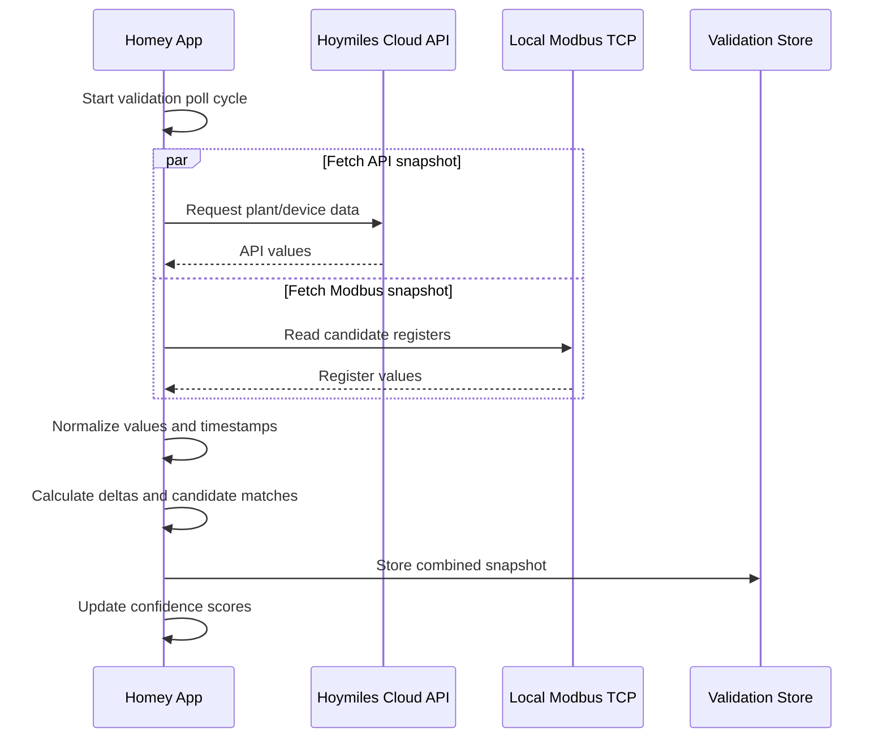

# Hoymiles Homey App — API + Modbus Validation Design

## Purpose

This document describes how the Homey app can support the next validation step:

> Capture Hoymiles Cloud API data and local Modbus TCP data at almost the same time, then compare both datasets over time.

The goal is to reverse-engineer and validate the local Modbus register mapping for the Hoymiles HiOne / HiBox / HiOne-16T-G3 setup before hard-coding Modbus registers into the Homey app.

The current findings are based on one combined dataset containing:

- a Modbus TCP deep scan from host `192.168.1.116`, port `502`, unit ID `1`;
- API polling logs from `2026-06-17 09:25` until `2026-06-17 10:25`;
- 11,500 readable Modbus registers;
- 1,977 non-zero Modbus registers;
- 1,311 scanned Modbus blocks.

Important: the Modbus deep scan is **not an atomic snapshot**. It started around `2026-06-17T10:06:25.770Z` and the related app logs show it completed later, while API values changed during that period. Therefore the mapping below must be treated as **preliminary**.

---

## Why simultaneous API + Modbus capture is needed

The current deep scan covers many register ranges and takes several minutes. During that time, the live system values change. For example, the API values around the scan period changed from:

```text
10:03:00  pv=0 bat=1636 soc=78 grid=24  load=707 daily=12.7 total=159.4
10:07:51  pv=0 bat=4249 soc=79 grid=-68 load=462 daily=13.0 total=159.4
10:12:50  pv=0 bat=8086 soc=80 grid=-12 load=599 daily=13.5 total=159.4
10:17:51  pv=0 bat=3034 soc=82 grid=36  load=598 daily=14.2 total=159.4
```

Because of this, a Modbus register value may match an API value from a different minute. The next test should therefore collect API and Modbus data inside the same polling cycle.

---

## Recommended Homey app approach

Add a developer / diagnostics mode to the Homey app:

```text
Enable Local Modbus Validation: true/false
Modbus host: 192.168.1.116
Modbus port: 502
Modbus unit ID: 1
Validation interval: 30 or 60 seconds
Candidate register mode: candidate-only / deep-scan-manual
```

Do **not** run a full `0x0000–0xFFFF` deep scan every minute. Use the full deep scan only as a manual diagnostic action. For periodic validation, read only a limited set of candidate registers.

---

## Proposed validation flow



---

## Snapshot structure

Each validation poll should store one combined object.

```json
{
  "timestampStart": "2026-06-17T10:03:00.000Z",
  "timestampEnd": "2026-06-17T10:03:01.250Z",
  "durationMs": 1250,
  "api": {
    "pvPowerW": 0,
    "batteryPowerW": 1636,
    "socPct": 78,
    "gridPowerW": 24,
    "loadPowerW": 707,
    "chargePowerW": 1636,
    "dischargePowerW": 0,
    "dailyEnergyKWh": 12.7,
    "totalEnergyKWh": 159.4,
    "mode": 1000
  },
  "modbus": {
    "raw": {
      "FC03:4616": 127,
      "FC03:4621": 127,
      "FC04:10030": 78,
      "FC04:5208": 65535,
      "FC04:5209": 65416
    },
    "derived": {
      "dailyEnergyKWhCandidate": 12.7,
      "socPctCandidate": 78,
      "gridPowerWCandidate": -12
    }
  }
}
```

---

## Homey implementation guidance

### 1. Add a validation poll method

Use one method that captures both API and Modbus data in the same cycle.

```js
async collectApiModbusValidationSnapshot() {
  if (this.validationInProgress) return;
  this.validationInProgress = true;

  const timestampStart = new Date();

  try {
    const [apiResult, modbusResult] = await Promise.allSettled([
      this.fetchHoymilesApiSnapshot(),
      this.fetchModbusCandidateSnapshot()
    ]);

    const timestampEnd = new Date();

    const snapshot = {
      timestampStart: timestampStart.toISOString(),
      timestampEnd: timestampEnd.toISOString(),
      durationMs: timestampEnd.getTime() - timestampStart.getTime(),
      api: apiResult.status === 'fulfilled' ? apiResult.value : null,
      modbus: modbusResult.status === 'fulfilled' ? modbusResult.value : null,
      errors: {
        api: apiResult.status === 'rejected' ? String(apiResult.reason) : null,
        modbus: modbusResult.status === 'rejected' ? String(modbusResult.reason) : null
      }
    };

    await this.storeValidationSnapshot(snapshot);
    this.updateValidationConfidence(snapshot);

  } finally {
    this.validationInProgress = false;
  }
}
```

### 2. Read only candidate ranges during validation

Recommended candidate ranges based on the current raw data:

```js
const CANDIDATE_RANGES = [
  // Daily energy / configuration-like area
  { fc: 3, start: 250, count: 40 },
  { fc: 3, start: 4600, count: 40 },

  // Live electrical values / battery power candidates
  { fc: 4, start: 50, count: 50 },
  { fc: 4, start: 190, count: 20 },

  // Grid signed 32-bit candidate
  { fc: 4, start: 5208, count: 4 },

  // Higher live-data blocks observed in the deep scan
  { fc: 4, start: 10000, count: 110 },
  { fc: 4, start: 12100, count: 90 }
];
```

Keep the same zero-based register addresses as used by the current scanner. Only add `+1` if your chosen Modbus library uses one-based display addresses instead of raw Modbus offsets.

### 3. Decode common value types

```js
function toSigned16(value) {
  return value > 0x7fff ? value - 0x10000 : value;
}

function toSigned32(highWord, lowWord) {
  const value = (highWord << 16) | lowWord;
  return value > 0x7fffffff ? value - 0x100000000 : value;
}

function scale(value, factor) {
  return value * factor;
}
```

Typical transforms to test:

```text
raw unsigned 16-bit
signed 16-bit
absolute signed 16-bit
value / 10
value / 100
signed 32-bit / 10
signed 32-bit / 100
absolute signed 32-bit
```

### 4. Store enough history

Store at least 24–48 hours of validation snapshots. A simple ring buffer is enough initially.

```js
const MAX_VALIDATION_SNAPSHOTS = 5000;
```

For each API field, store:

- API value;
- candidate Modbus value;
- difference;
- absolute difference;
- percentage difference where useful;
- timestamp skew / collection duration.

### 5. Calculate confidence scores

A register should only be promoted to a real Homey capability when it consistently matches the API.

Suggested acceptance criteria:

```text
SOC:
- Exact match or maximum ±1 percentage point
- Stable across multiple SOC changes

Daily energy:
- Same trend as API
- Difference normally ≤ 0.1 kWh
- Monotonic increase during the day

Power values:
- Correlation >= 0.95 over time
- Median absolute error preferably < 100 W
- Sign convention clearly understood

Mode / status:
- Same value during stable operating state
- Confirmed against at least two or three different operating modes if possible
```

---

## Preliminary API ↔ Modbus mapping

The table below is based on the current dataset only. Confidence levels are intentionally conservative.

| API field | API example value | Modbus candidate | Transform | Preliminary interpretation | Confidence |
|---|---:|---|---|---|---|
| `daily` | `12.7 kWh` | `FC03:4616 = 127` | `/ 10` | Daily energy candidate | High |
| `daily` | `12.7 kWh` | `FC03:4621 = 127` | `/ 10` | Duplicate daily energy candidate | Medium/High |
| `daily` | `12.7 kWh` | `FC03:4626 = 127` | `/ 10` | Duplicate daily energy candidate | Medium |
| `daily` | `12.7 kWh` | `FC03:4631 = 127` | `/ 10` | Duplicate daily energy candidate | Medium |
| `daily` | `14.2 kWh` | `FC04:12100 = 142` | `/ 10` | Later daily energy candidate | Medium/High |
| `daily` | `14.2 kWh` | `FC04:12107 = 142` | `/ 10` | Later duplicate daily energy candidate | Medium |
| `soc` | `78 %` | `FC04:10030 = 78` | raw value | SOC candidate | High for this snapshot |
| `soc` | `82 %` | `FC04:12115 = 82` | raw value | SOC candidate from later block | Medium/High |
| `soc` | `82 %` | `FC04:12117 = 82` | raw value | Duplicate SOC candidate | Medium |
| `soc` | `82 %` | `FC04:12133 = 82` | raw value | Duplicate SOC candidate | Medium |
| `bat` / `chg` | `3034 W` | `FC04:51 = -3025 signed` | `abs(signed16)` | Battery charging power candidate; sign likely inverted vs API | Medium |
| `bat` / `chg` | `3034 W` | `FC04:193 = -3027 signed` | `abs(signed16)` | Duplicate battery charging power candidate | Medium |
| `grid` | `-12 W` | `FC04:5208/5209 = 0xffff/0xff88` | signed 32-bit `/ 10` | Grid power candidate | Medium/High |
| `load` | `598 W` | `FC04:12162 = 59827` | `/ 100` | Load power candidate, but needs validation | Medium/Low |
| `load` | `707 W` | `FC04:10277 = 710` | raw value | Load power candidate close to API value | Low/Medium |
| `grid` | `36 W` | `FC03:4608 = 360` | `/ 10` | Possible match, but this block may be configuration-like | Low |
| `mode` | `1000` | `FC03:254 = 10000` | `/ 10` | Possible mode candidate | Low |
| `pv` | `0 W` | Not identified | n/a | API value is zero; zero registers are not useful in a non-zero register scan | Unresolved |
| `total` | `159.4 kWh` | Not identified | n/a | No convincing candidate found yet | Unresolved |

---

## Candidate registers to include in the Homey validation engine

```js
const CANDIDATE_REGISTERS = [
  // Energy
  { key: 'daily_fc03_4616', fc: 3, address: 4616, words: 1, transform: 'u16_div10' },
  { key: 'daily_fc03_4621', fc: 3, address: 4621, words: 1, transform: 'u16_div10' },
  { key: 'daily_fc03_4626', fc: 3, address: 4626, words: 1, transform: 'u16_div10' },
  { key: 'daily_fc03_4631', fc: 3, address: 4631, words: 1, transform: 'u16_div10' },
  { key: 'daily_fc04_12100', fc: 4, address: 12100, words: 1, transform: 'u16_div10' },
  { key: 'daily_fc04_12107', fc: 4, address: 12107, words: 1, transform: 'u16_div10' },

  // SOC
  { key: 'soc_fc04_10030', fc: 4, address: 10030, words: 1, transform: 'u16' },
  { key: 'soc_fc04_12115', fc: 4, address: 12115, words: 1, transform: 'u16' },
  { key: 'soc_fc04_12117', fc: 4, address: 12117, words: 1, transform: 'u16' },
  { key: 'soc_fc04_12133', fc: 4, address: 12133, words: 1, transform: 'u16' },

  // Battery power / charge power
  { key: 'battery_power_fc04_51', fc: 4, address: 51, words: 1, transform: 'abs_s16' },
  { key: 'battery_power_fc04_193', fc: 4, address: 193, words: 1, transform: 'abs_s16' },

  // Grid power
  { key: 'grid_power_fc04_5208', fc: 4, address: 5208, words: 2, transform: 's32_div10_hi_lo' },

  // Load power
  { key: 'load_power_fc04_12162', fc: 4, address: 12162, words: 1, transform: 'u16_div100' },
  { key: 'load_power_fc04_10277', fc: 4, address: 10277, words: 1, transform: 'u16' },

  // Mode / status candidate
  { key: 'mode_fc03_254', fc: 3, address: 254, words: 1, transform: 'u16_div10' }
];
```

---

## Other elements extractable from the raw Modbus data

Besides API-like plant values, the raw Modbus data appears to contain several other useful categories.

### 1. Scan and connection metadata

From the raw scan itself:

```text
Host: 192.168.1.116
Port: 502
Unit ID: 1
Readable registers: 11,500
Non-zero registers: 1,977
Blocks scanned: 1,311
```

This is useful for diagnostics in the Homey app.

### 2. ASCII strings / device identifiers

The deep scan contains ASCII-like strings, including:

```text
nO-e61-T3G
#5-T3G
91-T3G
320C621210E5
320C62121019
320C6212003E
```

The strings such as `nO-e61-T3G` look byte-swapped per 16-bit word. When the bytes are swapped, this resembles `One-16T-G3`, which is likely related to the `HiOne-16T-G3` model name. The values starting with `320C...` look like serial-number-like identifiers.

These should be decoded carefully before exposing them as device properties.

### 3. AC voltage candidates

Several register groups contain values that look like three-phase AC voltages:

```text
FC04:62  = 2383 -> 238.3 V
FC04:63  = 2384 -> 238.4 V
FC04:64  = 2362 -> 236.2 V

FC04:10062 = 2418 -> 241.8 V
FC04:10063 = 2418 -> 241.8 V
FC04:10064 = 2370 -> 237.0 V
```

These may correspond to L1/L2/L3 voltage, but this still needs validation.

### 4. Frequency candidates

Some values look like grid frequency:

```text
FC04:65 = 5000 -> 50.00 Hz
FC04:66 = 5000 -> 50.00 Hz

FC04:10065 = 4999 -> 49.99 Hz
FC04:10066 = 4999 -> 49.99 Hz
```

These are strong candidates for AC frequency values.

### 5. Temperature candidates

Some values look like temperatures:

```text
FC04:78 = 241 -> 24.1 °C
FC04:79 = 225 -> 22.5 °C
FC04:80 = 269 -> 26.9 °C

FC04:10078 = 258 -> 25.8 °C
FC04:10079 = 385 -> 38.5 °C
FC04:10080 = 396 -> 39.6 °C
```

These could be inverter, battery, ambient, or internal component temperatures. The exact meaning is not confirmed.

### 6. DC / battery / PV voltage candidates

Several values look like DC bus, PV string, or battery voltages:

```text
FC04:58 = 3927 -> 392.7 V
FC04:59 = 3927 -> 392.7 V
FC04:60 = 7846 -> 784.6 V

FC04:10058 = 3962 -> 396.2 V
FC04:10059 = 3962 -> 396.2 V
FC04:10060 = 7915 -> 791.5 V
```

These are plausible voltage values but the exact assignment is not yet known.

### 7. Configuration / grid-code limit candidates

The `FC03:100–149` and `FC03:250–289` areas contain many values that look like configuration limits rather than live measurements, for example:

```text
230.0 V
50.0 Hz
264.5 V
195.5 V
161.0 V
184.0 V
253.0 V
515.0 V
475.0 V
```

These may represent voltage/frequency thresholds, grid-code settings, protection settings, or operating limits. They are useful for diagnostics but should not be treated as live sensor values without further validation.

### 8. Repeated data blocks

The same type of values appears in multiple areas, for example around:

```text
FC04:50–99
FC04:190–244
FC04:10000–10100
FC04:12100–12180
```

This suggests that the Modbus map may contain multiple layers, such as:

- plant-level values;
- inverter-level values;
- gateway-level values;
- battery/module-level values;
- duplicated history or mirror blocks.

The validation engine should therefore not assume that the first matching register is the correct one. It should compare trends over time.

---

## Recommended Homey capabilities once validated

Once the register mapping is stable, the Homey app can expose these values on the main plant device:

```text
measure_battery
measure_battery.charge
measure_battery.power
measure_power.pv
measure_power.grid
measure_power.load
meter_power.daily
meter_power.total
measure_voltage.phase_l1
measure_voltage.phase_l2
measure_voltage.phase_l3
measure_frequency
measure_temperature.inverter
measure_temperature.battery
```

For child devices, the same validated register map can later be split into:

```text
Main device: HiOne Plant / Station
Inverter child: HiOne-16T-G3
Gateway child: HiBox-63T-G3
Battery module children: HiOne-8B-G3 modules
```

---

## Recommended validation scenarios

Run the validation for at least 24–48 hours and try to capture these scenarios:

1. PV production is zero.
2. PV production is active.
3. Battery is charging.
4. Battery is discharging.
5. Battery is idle.
6. Grid import is positive.
7. Grid export is negative.
8. Load changes significantly, for example by switching a large appliance on/off.
9. SOC changes by at least several percentage points.
10. Daily energy increases during the day.

This will make the correct Modbus registers much easier to identify.

---

## Practical next step

Implement the validation collector first, before changing the production Homey capabilities.

Recommended sequence:

1. Add `Enable Local Modbus Validation` to app settings.
2. Add candidate register reading.
3. Store combined API + Modbus snapshots.
4. Run the collector every 30 or 60 seconds.
5. Export or log the snapshots.
6. Calculate confidence per candidate register.
7. Promote only high-confidence mappings to production capabilities.

---

## Current conclusion

The current dataset already gives useful clues:

- Daily energy has a strong candidate: `FC03:4616 / 10`.
- SOC has strong candidates: especially `FC04:10030` and later `FC04:12115`.
- Battery charging power likely uses signed values where charging is negative in Modbus but positive in the API.
- Grid power likely requires signed 32-bit decoding in at least one register pair.
- Load power has possible candidates but is not yet reliable.
- Total energy is not identified yet.
- PV power is unresolved because the API value is zero in the dataset.

The most reliable way forward is to capture API and Modbus in the same Homey poll cycle and let the app build confidence over time.
